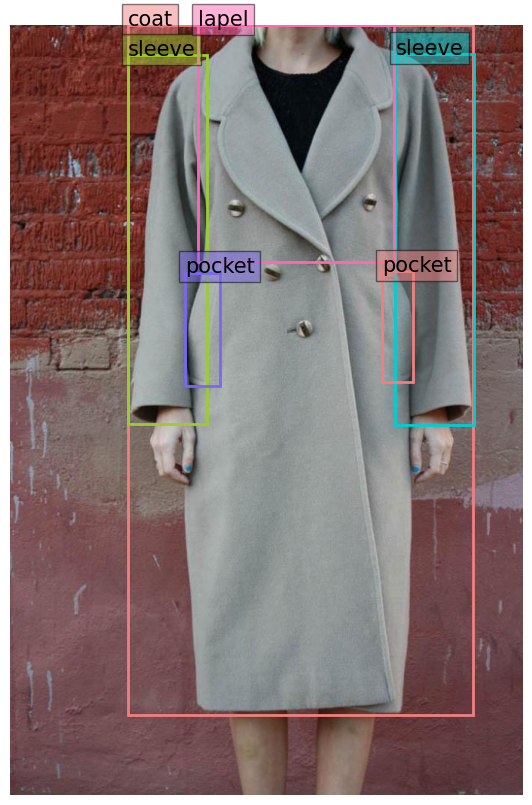
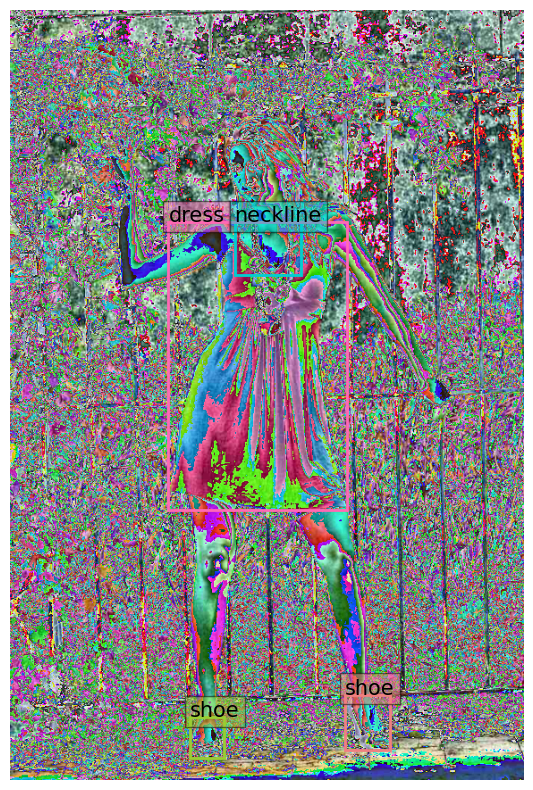

First of all we are going to install a couple of libraries needed for interacting with Hugging Face. We are going to use HuggingFace for downloading a pretrained model and a dataset we will use for fine-tunning it.

- Lighting: PyTorch Lighting will provide a high-level interface for PyTorch, a popular machine learning framework.
- Datasets: A library for interacting with uploaded datasets available on the Hugging Face Hub.
- Transformers: A library for interacting with pre-trained models available on the Hugging Face Hub.


```python
!pip uninstall pigments
```

    Found existing installation: Pigments 1.6
    Uninstalling Pigments-1.6:
      Would remove:
        /usr/local/bin/pygmentize
        /usr/local/lib/python3.10/dist-packages/Pigments-1.6.dist-info/*
        /usr/local/lib/python3.10/dist-packages/pygments/*
      Would not remove (might be manually added):
        /usr/local/lib/python3.10/dist-packages/pygments/__main__.py
        /usr/local/lib/python3.10/dist-packages/pygments/formatters/groff.py
        /usr/local/lib/python3.10/dist-packages/pygments/formatters/irc.py
        /usr/local/lib/python3.10/dist-packages/pygments/formatters/pangomarkup.py
        /usr/local/lib/python3.10/dist-packages/pygments/lexers/_ada_builtins.py
        /usr/local/lib/python3.10/dist-packages/pygments/lexers/_asy_builtins.py
        /usr/local/lib/python3.10/dist-packages/pygments/lexers/_cl_builtins.py
        /usr/local/lib/python3.10/dist-packages/pygments/lexers/_cocoa_builtins.py
        /usr/local/lib/python3.10/dist-packages/pygments/lexers/_csound_builtins.py
        /usr/local/lib/python3.10/dist-packages/pygments/lexers/_css_builtins.py
        /usr/local/lib/python3.10/dist-packages/pygments/lexers/_julia_builtins.py
        /usr/local/lib/python3.10/dist-packages/pygments/lexers/_lasso_builtins.py
        /usr/local/lib/python3.10/dist-packages/pygments/lexers/_lilypond_builtins.py
        /usr/local/lib/python3.10/dist-packages/pygments/lexers/_lua_builtins.py
        /usr/local/lib/python3.10/dist-packages/pygments/lexers/_mql_builtins.py
        /usr/local/lib/python3.10/dist-packages/pygments/lexers/_mysql_builtins.py
        /usr/local/lib/python3.10/dist-packages/pygments/lexers/_openedge_builtins.py
        /usr/local/lib/python3.10/dist-packages/pygments/lexers/_php_builtins.py
        /usr/local/lib/python3.10/dist-packages/pygments/lexers/_qlik_builtins.py
        /usr/local/lib/python3.10/dist-packages/pygments/lexers/_scheme_builtins.py
        /usr/local/lib/python3.10/dist-packages/pygments/lexers/_sourcemod_builtins.py
        /usr/local/lib/python3.10/dist-packages/pygments/lexers/_stata_builtins.py
        /usr/local/lib/python3.10/dist-packages/pygments/lexers/_tsql_builtins.py
        /usr/local/lib/python3.10/dist-packages/pygments/lexers/_usd_builtins.py
        /usr/local/lib/python3.10/dist-packages/pygments/lexers/_vbscript_builtins.py
        /usr/local/lib/python3.10/dist-packages/pygments/lexers/_vim_builtins.py
        /usr/local/lib/python3.10/dist-packages/pygments/lexers/actionscript.py
        /usr/local/lib/python3.10/dist-packages/pygments/lexers/ada.py
        /usr/local/lib/python3.10/dist-packages/pygments/lexers/algebra.py
        /usr/local/lib/python3.10/dist-packages/pygments/lexers/ambient.py
        /usr/local/lib/python3.10/dist-packages/pygments/lexers/amdgpu.py
        /usr/local/lib/python3.10/dist-packages/pygments/lexers/ampl.py
        /usr/local/lib/python3.10/dist-packages/pygments/lexers/apdlexer.py
        /usr/local/lib/python3.10/dist-packages/pygments/lexers/apl.py
        /usr/local/lib/python3.10/dist-packages/pygments/lexers/archetype.py
        /usr/local/lib/python3.10/dist-packages/pygments/lexers/arrow.py
        /usr/local/lib/python3.10/dist-packages/pygments/lexers/arturo.py
        /usr/local/lib/python3.10/dist-packages/pygments/lexers/asc.py
        /usr/local/lib/python3.10/dist-packages/pygments/lexers/automation.py
        /usr/local/lib/python3.10/dist-packages/pygments/lexers/bare.py
        /usr/local/lib/python3.10/dist-packages/pygments/lexers/basic.py
        /usr/local/lib/python3.10/dist-packages/pygments/lexers/bdd.py
        /usr/local/lib/python3.10/dist-packages/pygments/lexers/berry.py
        /usr/local/lib/python3.10/dist-packages/pygments/lexers/bibtex.py
        /usr/local/lib/python3.10/dist-packages/pygments/lexers/boa.py
        /usr/local/lib/python3.10/dist-packages/pygments/lexers/business.py
        /usr/local/lib/python3.10/dist-packages/pygments/lexers/c_cpp.py
        /usr/local/lib/python3.10/dist-packages/pygments/lexers/c_like.py
        /usr/local/lib/python3.10/dist-packages/pygments/lexers/capnproto.py
        /usr/local/lib/python3.10/dist-packages/pygments/lexers/cddl.py
        /usr/local/lib/python3.10/dist-packages/pygments/lexers/chapel.py
        /usr/local/lib/python3.10/dist-packages/pygments/lexers/clean.py
        /usr/local/lib/python3.10/dist-packages/pygments/lexers/comal.py
        /usr/local/lib/python3.10/dist-packages/pygments/lexers/configs.py
        /usr/local/lib/python3.10/dist-packages/pygments/lexers/console.py
        /usr/local/lib/python3.10/dist-packages/pygments/lexers/cplint.py
        /usr/local/lib/python3.10/dist-packages/pygments/lexers/crystal.py
        /usr/local/lib/python3.10/dist-packages/pygments/lexers/csound.py
        /usr/local/lib/python3.10/dist-packages/pygments/lexers/css.py
        /usr/local/lib/python3.10/dist-packages/pygments/lexers/d.py
        /usr/local/lib/python3.10/dist-packages/pygments/lexers/data.py
        /usr/local/lib/python3.10/dist-packages/pygments/lexers/devicetree.py
        /usr/local/lib/python3.10/dist-packages/pygments/lexers/diff.py
        /usr/local/lib/python3.10/dist-packages/pygments/lexers/dsls.py
        /usr/local/lib/python3.10/dist-packages/pygments/lexers/dylan.py
        /usr/local/lib/python3.10/dist-packages/pygments/lexers/ecl.py
        /usr/local/lib/python3.10/dist-packages/pygments/lexers/eiffel.py
        /usr/local/lib/python3.10/dist-packages/pygments/lexers/elm.py
        /usr/local/lib/python3.10/dist-packages/pygments/lexers/elpi.py
        /usr/local/lib/python3.10/dist-packages/pygments/lexers/email.py
        /usr/local/lib/python3.10/dist-packages/pygments/lexers/erlang.py
        /usr/local/lib/python3.10/dist-packages/pygments/lexers/esoteric.py
        /usr/local/lib/python3.10/dist-packages/pygments/lexers/ezhil.py
        /usr/local/lib/python3.10/dist-packages/pygments/lexers/factor.py
        /usr/local/lib/python3.10/dist-packages/pygments/lexers/fantom.py
        /usr/local/lib/python3.10/dist-packages/pygments/lexers/felix.py
        /usr/local/lib/python3.10/dist-packages/pygments/lexers/fift.py
        /usr/local/lib/python3.10/dist-packages/pygments/lexers/floscript.py
        /usr/local/lib/python3.10/dist-packages/pygments/lexers/forth.py
        /usr/local/lib/python3.10/dist-packages/pygments/lexers/fortran.py
        /usr/local/lib/python3.10/dist-packages/pygments/lexers/freefem.py
        /usr/local/lib/python3.10/dist-packages/pygments/lexers/func.py
        /usr/local/lib/python3.10/dist-packages/pygments/lexers/futhark.py
        /usr/local/lib/python3.10/dist-packages/pygments/lexers/gcodelexer.py
        /usr/local/lib/python3.10/dist-packages/pygments/lexers/gdscript.py
        /usr/local/lib/python3.10/dist-packages/pygments/lexers/go.py
        /usr/local/lib/python3.10/dist-packages/pygments/lexers/grammar_notation.py
        /usr/local/lib/python3.10/dist-packages/pygments/lexers/graph.py
        /usr/local/lib/python3.10/dist-packages/pygments/lexers/graphics.py
        /usr/local/lib/python3.10/dist-packages/pygments/lexers/graphviz.py
        /usr/local/lib/python3.10/dist-packages/pygments/lexers/gsql.py
        /usr/local/lib/python3.10/dist-packages/pygments/lexers/haskell.py
        /usr/local/lib/python3.10/dist-packages/pygments/lexers/haxe.py
        /usr/local/lib/python3.10/dist-packages/pygments/lexers/hexdump.py
        /usr/local/lib/python3.10/dist-packages/pygments/lexers/html.py
        /usr/local/lib/python3.10/dist-packages/pygments/lexers/idl.py
        /usr/local/lib/python3.10/dist-packages/pygments/lexers/igor.py
        /usr/local/lib/python3.10/dist-packages/pygments/lexers/inferno.py
        /usr/local/lib/python3.10/dist-packages/pygments/lexers/installers.py
        /usr/local/lib/python3.10/dist-packages/pygments/lexers/int_fiction.py
        /usr/local/lib/python3.10/dist-packages/pygments/lexers/iolang.py
        /usr/local/lib/python3.10/dist-packages/pygments/lexers/j.py
        /usr/local/lib/python3.10/dist-packages/pygments/lexers/javascript.py
        /usr/local/lib/python3.10/dist-packages/pygments/lexers/jmespath.py
        /usr/local/lib/python3.10/dist-packages/pygments/lexers/jslt.py
        /usr/local/lib/python3.10/dist-packages/pygments/lexers/jsonnet.py
        /usr/local/lib/python3.10/dist-packages/pygments/lexers/julia.py
        /usr/local/lib/python3.10/dist-packages/pygments/lexers/kuin.py
        /usr/local/lib/python3.10/dist-packages/pygments/lexers/lilypond.py
        /usr/local/lib/python3.10/dist-packages/pygments/lexers/lisp.py
        /usr/local/lib/python3.10/dist-packages/pygments/lexers/macaulay2.py
        /usr/local/lib/python3.10/dist-packages/pygments/lexers/make.py
        /usr/local/lib/python3.10/dist-packages/pygments/lexers/markup.py
        /usr/local/lib/python3.10/dist-packages/pygments/lexers/matlab.py
        /usr/local/lib/python3.10/dist-packages/pygments/lexers/maxima.py
        /usr/local/lib/python3.10/dist-packages/pygments/lexers/meson.py
        /usr/local/lib/python3.10/dist-packages/pygments/lexers/mime.py
        /usr/local/lib/python3.10/dist-packages/pygments/lexers/minecraft.py
        /usr/local/lib/python3.10/dist-packages/pygments/lexers/mips.py
        /usr/local/lib/python3.10/dist-packages/pygments/lexers/ml.py
        /usr/local/lib/python3.10/dist-packages/pygments/lexers/modeling.py
        /usr/local/lib/python3.10/dist-packages/pygments/lexers/modula2.py
        /usr/local/lib/python3.10/dist-packages/pygments/lexers/monte.py
        /usr/local/lib/python3.10/dist-packages/pygments/lexers/mosel.py
        /usr/local/lib/python3.10/dist-packages/pygments/lexers/ncl.py
        /usr/local/lib/python3.10/dist-packages/pygments/lexers/nimrod.py
        /usr/local/lib/python3.10/dist-packages/pygments/lexers/nit.py
        /usr/local/lib/python3.10/dist-packages/pygments/lexers/nix.py
        /usr/local/lib/python3.10/dist-packages/pygments/lexers/oberon.py
        /usr/local/lib/python3.10/dist-packages/pygments/lexers/objective.py
        /usr/local/lib/python3.10/dist-packages/pygments/lexers/ooc.py
        /usr/local/lib/python3.10/dist-packages/pygments/lexers/parasail.py
        /usr/local/lib/python3.10/dist-packages/pygments/lexers/pascal.py
        /usr/local/lib/python3.10/dist-packages/pygments/lexers/pawn.py
        /usr/local/lib/python3.10/dist-packages/pygments/lexers/perl.py
        /usr/local/lib/python3.10/dist-packages/pygments/lexers/phix.py
        /usr/local/lib/python3.10/dist-packages/pygments/lexers/php.py
        /usr/local/lib/python3.10/dist-packages/pygments/lexers/pointless.py
        /usr/local/lib/python3.10/dist-packages/pygments/lexers/pony.py
        /usr/local/lib/python3.10/dist-packages/pygments/lexers/praat.py
        /usr/local/lib/python3.10/dist-packages/pygments/lexers/procfile.py
        /usr/local/lib/python3.10/dist-packages/pygments/lexers/prolog.py
        /usr/local/lib/python3.10/dist-packages/pygments/lexers/promql.py
        /usr/local/lib/python3.10/dist-packages/pygments/lexers/python.py
        /usr/local/lib/python3.10/dist-packages/pygments/lexers/q.py
        /usr/local/lib/python3.10/dist-packages/pygments/lexers/qlik.py
        /usr/local/lib/python3.10/dist-packages/pygments/lexers/qvt.py
        /usr/local/lib/python3.10/dist-packages/pygments/lexers/r.py
        /usr/local/lib/python3.10/dist-packages/pygments/lexers/rdf.py
        /usr/local/lib/python3.10/dist-packages/pygments/lexers/rebol.py
        /usr/local/lib/python3.10/dist-packages/pygments/lexers/resource.py
        /usr/local/lib/python3.10/dist-packages/pygments/lexers/ride.py
        /usr/local/lib/python3.10/dist-packages/pygments/lexers/rita.py
        /usr/local/lib/python3.10/dist-packages/pygments/lexers/rnc.py
        /usr/local/lib/python3.10/dist-packages/pygments/lexers/roboconf.py
        /usr/local/lib/python3.10/dist-packages/pygments/lexers/robotframework.py
        /usr/local/lib/python3.10/dist-packages/pygments/lexers/ruby.py
        /usr/local/lib/python3.10/dist-packages/pygments/lexers/rust.py
        /usr/local/lib/python3.10/dist-packages/pygments/lexers/sas.py
        /usr/local/lib/python3.10/dist-packages/pygments/lexers/savi.py
        /usr/local/lib/python3.10/dist-packages/pygments/lexers/scdoc.py
        /usr/local/lib/python3.10/dist-packages/pygments/lexers/scripting.py
        /usr/local/lib/python3.10/dist-packages/pygments/lexers/sgf.py
        /usr/local/lib/python3.10/dist-packages/pygments/lexers/sieve.py
        /usr/local/lib/python3.10/dist-packages/pygments/lexers/slash.py
        /usr/local/lib/python3.10/dist-packages/pygments/lexers/smalltalk.py
        /usr/local/lib/python3.10/dist-packages/pygments/lexers/smithy.py
        /usr/local/lib/python3.10/dist-packages/pygments/lexers/smv.py
        /usr/local/lib/python3.10/dist-packages/pygments/lexers/snobol.py
        /usr/local/lib/python3.10/dist-packages/pygments/lexers/solidity.py
        /usr/local/lib/python3.10/dist-packages/pygments/lexers/sophia.py
        /usr/local/lib/python3.10/dist-packages/pygments/lexers/spice.py
        /usr/local/lib/python3.10/dist-packages/pygments/lexers/srcinfo.py
        /usr/local/lib/python3.10/dist-packages/pygments/lexers/stata.py
        /usr/local/lib/python3.10/dist-packages/pygments/lexers/supercollider.py
        /usr/local/lib/python3.10/dist-packages/pygments/lexers/tal.py
        /usr/local/lib/python3.10/dist-packages/pygments/lexers/tcl.py
        /usr/local/lib/python3.10/dist-packages/pygments/lexers/teal.py
        /usr/local/lib/python3.10/dist-packages/pygments/lexers/teraterm.py
        /usr/local/lib/python3.10/dist-packages/pygments/lexers/testing.py
        /usr/local/lib/python3.10/dist-packages/pygments/lexers/textedit.py
        /usr/local/lib/python3.10/dist-packages/pygments/lexers/textfmts.py
        /usr/local/lib/python3.10/dist-packages/pygments/lexers/theorem.py
        /usr/local/lib/python3.10/dist-packages/pygments/lexers/thingsdb.py
        /usr/local/lib/python3.10/dist-packages/pygments/lexers/tlb.py
        /usr/local/lib/python3.10/dist-packages/pygments/lexers/tnt.py
        /usr/local/lib/python3.10/dist-packages/pygments/lexers/trafficscript.py
        /usr/local/lib/python3.10/dist-packages/pygments/lexers/typoscript.py
        /usr/local/lib/python3.10/dist-packages/pygments/lexers/ul4.py
        /usr/local/lib/python3.10/dist-packages/pygments/lexers/unicon.py
        /usr/local/lib/python3.10/dist-packages/pygments/lexers/urbi.py
        /usr/local/lib/python3.10/dist-packages/pygments/lexers/usd.py
        /usr/local/lib/python3.10/dist-packages/pygments/lexers/varnish.py
        /usr/local/lib/python3.10/dist-packages/pygments/lexers/verification.py
        /usr/local/lib/python3.10/dist-packages/pygments/lexers/webassembly.py
        /usr/local/lib/python3.10/dist-packages/pygments/lexers/webidl.py
        /usr/local/lib/python3.10/dist-packages/pygments/lexers/webmisc.py
        /usr/local/lib/python3.10/dist-packages/pygments/lexers/whiley.py
        /usr/local/lib/python3.10/dist-packages/pygments/lexers/wowtoc.py
        /usr/local/lib/python3.10/dist-packages/pygments/lexers/wren.py
        /usr/local/lib/python3.10/dist-packages/pygments/lexers/x10.py
        /usr/local/lib/python3.10/dist-packages/pygments/lexers/xorg.py
        /usr/local/lib/python3.10/dist-packages/pygments/lexers/yang.py
        /usr/local/lib/python3.10/dist-packages/pygments/lexers/zig.py
        /usr/local/lib/python3.10/dist-packages/pygments/regexopt.py
        /usr/local/lib/python3.10/dist-packages/pygments/sphinxext.py
        /usr/local/lib/python3.10/dist-packages/pygments/styles/abap.py
        /usr/local/lib/python3.10/dist-packages/pygments/styles/algol.py
        /usr/local/lib/python3.10/dist-packages/pygments/styles/algol_nu.py
        /usr/local/lib/python3.10/dist-packages/pygments/styles/arduino.py
        /usr/local/lib/python3.10/dist-packages/pygments/styles/dracula.py
        /usr/local/lib/python3.10/dist-packages/pygments/styles/friendly_grayscale.py
        /usr/local/lib/python3.10/dist-packages/pygments/styles/gh_dark.py
        /usr/local/lib/python3.10/dist-packages/pygments/styles/gruvbox.py
        /usr/local/lib/python3.10/dist-packages/pygments/styles/igor.py
        /usr/local/lib/python3.10/dist-packages/pygments/styles/inkpot.py
        /usr/local/lib/python3.10/dist-packages/pygments/styles/lilypond.py
        /usr/local/lib/python3.10/dist-packages/pygments/styles/lovelace.py
        /usr/local/lib/python3.10/dist-packages/pygments/styles/material.py
        /usr/local/lib/python3.10/dist-packages/pygments/styles/nord.py
        /usr/local/lib/python3.10/dist-packages/pygments/styles/onedark.py
        /usr/local/lib/python3.10/dist-packages/pygments/styles/paraiso_dark.py
        /usr/local/lib/python3.10/dist-packages/pygments/styles/paraiso_light.py
        /usr/local/lib/python3.10/dist-packages/pygments/styles/rainbow_dash.py
        /usr/local/lib/python3.10/dist-packages/pygments/styles/sas.py
        /usr/local/lib/python3.10/dist-packages/pygments/styles/solarized.py
        /usr/local/lib/python3.10/dist-packages/pygments/styles/staroffice.py
        /usr/local/lib/python3.10/dist-packages/pygments/styles/stata_dark.py
        /usr/local/lib/python3.10/dist-packages/pygments/styles/stata_light.py
        /usr/local/lib/python3.10/dist-packages/pygments/styles/xcode.py
        /usr/local/lib/python3.10/dist-packages/pygments/styles/zenburn.py
    Proceed (Y/n)? 


```python
!pip install lightning
!pip install pigments
!pip install transformers==4.23.1
!pip install datasets==2.6.1
!pip install huggingface-hub==0.11.1
```

    Looking in indexes: https://pypi.org/simple, https://us-python.pkg.dev/colab-wheels/public/simple/
    Collecting lightning
      Downloading lightning-2.0.3-py3-none-any.whl (1.8 MB)
         ━━━━━━━━━━━━━━━━━━━━━━━━━━━━━━━━━━━━━━━━ 1.8/1.8 MB 40.2 MB/s eta 0:00:00
    [?25hRequirement already satisfied: Jinja2<5.0 in /usr/local/lib/python3.10/dist-packages (from lightning) (3.1.2)
    Requirement already satisfied: PyYAML<8.0 in /usr/local/lib/python3.10/dist-packages (from lightning) (6.0)
    Collecting arrow<3.0,>=1.2.0 (from lightning)
      Downloading arrow-1.2.3-py3-none-any.whl (66 kB)
         ━━━━━━━━━━━━━━━━━━━━━━━━━━━━━━━━━━━━━━━━ 66.4/66.4 kB 9.3 MB/s eta 0:00:00
    [?25hRequirement already satisfied: beautifulsoup4<6.0,>=4.8.0 in /usr/local/lib/python3.10/dist-packages (from lightning) (4.11.2)
    Requirement already satisfied: click<10.0 in /usr/local/lib/python3.10/dist-packages (from lightning) (8.1.3)
    Collecting croniter<1.4.0,>=1.3.0 (from lightning)
      Downloading croniter-1.3.15-py2.py3-none-any.whl (19 kB)
    Collecting dateutils<2.0 (from lightning)
      Downloading dateutils-0.6.12-py2.py3-none-any.whl (5.7 kB)
    Collecting deepdiff<8.0,>=5.7.0 (from lightning)
      Downloading deepdiff-6.3.0-py3-none-any.whl (69 kB)
         ━━━━━━━━━━━━━━━━━━━━━━━━━━━━━━━━━━━━━━━━ 69.7/69.7 kB 10.3 MB/s eta 0:00:00
    [?25hCollecting fastapi<0.89.0,>=0.69.0 (from lightning)
      Downloading fastapi-0.88.0-py3-none-any.whl (55 kB)
         ━━━━━━━━━━━━━━━━━━━━━━━━━━━━━━━━━━━━━━━━ 55.5/55.5 kB 8.2 MB/s eta 0:00:00
    [?25hRequirement already satisfied: fsspec<2024.0,>=2022.5.0 in /usr/local/lib/python3.10/dist-packages (from lightning) (2023.4.0)
    Collecting inquirer<5.0,>=2.10.0 (from lightning)
      Downloading inquirer-3.1.3-py3-none-any.whl (18 kB)
    Collecting lightning-cloud>=0.5.34 (from lightning)
      Downloading lightning_cloud-0.5.36-py3-none-any.whl (562 kB)
         ━━━━━━━━━━━━━━━━━━━━━━━━━━━━━━━━━━━━━━ 562.4/562.4 kB 54.2 MB/s eta 0:00:00
    [?25hCollecting lightning-utilities<2.0,>=0.7.0 (from lightning)
      Downloading lightning_utilities-0.8.0-py3-none-any.whl (20 kB)
    Requirement already satisfied: numpy<3.0,>=1.17.2 in /usr/local/lib/python3.10/dist-packages (from lightning) (1.22.4)
    Requirement already satisfied: packaging in /usr/local/lib/python3.10/dist-packages (from lightning) (23.1)
    Requirement already satisfied: psutil<7.0 in /usr/local/lib/python3.10/dist-packages (from lightning) (5.9.5)
    Requirement already satisfied: pydantic<4.0,>=1.7.4 in /usr/local/lib/python3.10/dist-packages (from lightning) (1.10.7)
    Collecting python-multipart<2.0,>=0.0.5 (from lightning)
      Downloading python_multipart-0.0.6-py3-none-any.whl (45 kB)
         ━━━━━━━━━━━━━━━━━━━━━━━━━━━━━━━━━━━━━━━━ 45.7/45.7 kB 6.3 MB/s eta 0:00:00
    [?25hRequirement already satisfied: requests<4.0 in /usr/local/lib/python3.10/dist-packages (from lightning) (2.27.1)
    Requirement already satisfied: rich<15.0,>=12.3.0 in /usr/local/lib/python3.10/dist-packages (from lightning) (13.3.4)
    Collecting starlette (from lightning)
      Downloading starlette-0.28.0-py3-none-any.whl (68 kB)
         ━━━━━━━━━━━━━━━━━━━━━━━━━━━━━━━━━━━━━━━━ 68.9/68.9 kB 9.8 MB/s eta 0:00:00
    [?25hCollecting starsessions<2.0,>=1.2.1 (from lightning)
      Downloading starsessions-1.3.0-py3-none-any.whl (10 kB)
    Requirement already satisfied: torch<4.0,>=1.11.0 in /usr/local/lib/python3.10/dist-packages (from lightning) (2.0.1+cu118)
    Collecting torchmetrics<2.0,>=0.7.0 (from lightning)
      Downloading torchmetrics-0.11.4-py3-none-any.whl (519 kB)
         ━━━━━━━━━━━━━━━━━━━━━━━━━━━━━━━━━━━━━━ 519.2/519.2 kB 54.1 MB/s eta 0:00:00
    [?25hRequirement already satisfied: tqdm<6.0,>=4.57.0 in /usr/local/lib/python3.10/dist-packages (from lightning) (4.65.0)
    Requirement already satisfied: traitlets<7.0,>=5.3.0 in /usr/local/lib/python3.10/dist-packages (from lightning) (5.7.1)
    Requirement already satisfied: typing-extensions<6.0,>=4.0.0 in /usr/local/lib/python3.10/dist-packages (from lightning) (4.5.0)
    Requirement already satisfied: urllib3<3.0 in /usr/local/lib/python3.10/dist-packages (from lightning) (1.26.15)
    Collecting uvicorn<2.0 (from lightning)
      Downloading uvicorn-0.22.0-py3-none-any.whl (58 kB)
         ━━━━━━━━━━━━━━━━━━━━━━━━━━━━━━━━━━━━━━━━ 58.3/58.3 kB 8.4 MB/s eta 0:00:00
    [?25hRequirement already satisfied: websocket-client<3.0 in /usr/local/lib/python3.10/dist-packages (from lightning) (1.5.1)
    Collecting websockets<12.0 (from lightning)
      Downloading websockets-11.0.3-cp310-cp310-manylinux_2_5_x86_64.manylinux1_x86_64.manylinux_2_17_x86_64.manylinux2014_x86_64.whl (129 kB)
         ━━━━━━━━━━━━━━━━━━━━━━━━━━━━━━━━━━━━━━ 129.9/129.9 kB 17.0 MB/s eta 0:00:00
    [?25hCollecting pytorch-lightning (from lightning)
      Downloading pytorch_lightning-2.0.3-py3-none-any.whl (720 kB)
         ━━━━━━━━━━━━━━━━━━━━━━━━━━━━━━━━━━━━━━ 720.6/720.6 kB 66.6 MB/s eta 0:00:00
    [?25hRequirement already satisfied: python-dateutil>=2.7.0 in /usr/local/lib/python3.10/dist-packages (from arrow<3.0,>=1.2.0->lightning) (2.8.2)
    Requirement already satisfied: soupsieve>1.2 in /usr/local/lib/python3.10/dist-packages (from beautifulsoup4<6.0,>=4.8.0->lightning) (2.4.1)
    Requirement already satisfied: pytz in /usr/local/lib/python3.10/dist-packages (from dateutils<2.0->lightning) (2022.7.1)
    Collecting ordered-set<4.2.0,>=4.0.2 (from deepdiff<8.0,>=5.7.0->lightning)
      Downloading ordered_set-4.1.0-py3-none-any.whl (7.6 kB)
    Collecting starlette (from lightning)
      Downloading starlette-0.22.0-py3-none-any.whl (64 kB)
         ━━━━━━━━━━━━━━━━━━━━━━━━━━━━━━━━━━━━━━━━ 64.3/64.3 kB 9.8 MB/s eta 0:00:00
    [?25hRequirement already satisfied: anyio<5,>=3.4.0 in /usr/local/lib/python3.10/dist-packages (from starlette->lightning) (3.6.2)
    Collecting aiohttp!=4.0.0a0,!=4.0.0a1 (from fsspec<2024.0,>=2022.5.0->lightning)
      Downloading aiohttp-3.8.4-cp310-cp310-manylinux_2_17_x86_64.manylinux2014_x86_64.whl (1.0 MB)
         ━━━━━━━━━━━━━━━━━━━━━━━━━━━━━━━━━━━━━━━━ 1.0/1.0 MB 60.2 MB/s eta 0:00:00
    [?25hCollecting blessed>=1.19.0 (from inquirer<5.0,>=2.10.0->lightning)
      Downloading blessed-1.20.0-py2.py3-none-any.whl (58 kB)
         ━━━━━━━━━━━━━━━━━━━━━━━━━━━━━━━━━━━━━━━━ 58.4/58.4 kB 8.4 MB/s eta 0:00:00
    [?25hCollecting python-editor>=1.0.4 (from inquirer<5.0,>=2.10.0->lightning)
      Downloading python_editor-1.0.4-py3-none-any.whl (4.9 kB)
    Collecting readchar>=3.0.6 (from inquirer<5.0,>=2.10.0->lightning)
      Downloading readchar-4.0.5-py3-none-any.whl (8.5 kB)
    Requirement already satisfied: MarkupSafe>=2.0 in /usr/local/lib/python3.10/dist-packages (from Jinja2<5.0->lightning) (2.1.2)
    Collecting pyjwt (from lightning-cloud>=0.5.34->lightning)
      Downloading PyJWT-2.7.0-py3-none-any.whl (22 kB)
    Requirement already satisfied: six in /usr/local/lib/python3.10/dist-packages (from lightning-cloud>=0.5.34->lightning) (1.16.0)
    Requirement already satisfied: certifi>=2017.4.17 in /usr/local/lib/python3.10/dist-packages (from requests<4.0->lightning) (2022.12.7)
    Requirement already satisfied: charset-normalizer~=2.0.0 in /usr/local/lib/python3.10/dist-packages (from requests<4.0->lightning) (2.0.12)
    Requirement already satisfied: idna<4,>=2.5 in /usr/local/lib/python3.10/dist-packages (from requests<4.0->lightning) (3.4)
    Requirement already satisfied: markdown-it-py<3.0.0,>=2.2.0 in /usr/local/lib/python3.10/dist-packages (from rich<15.0,>=12.3.0->lightning) (2.2.0)
    Requirement already satisfied: pygments<3.0.0,>=2.13.0 in /usr/local/lib/python3.10/dist-packages (from rich<15.0,>=12.3.0->lightning) (2.14.0)
    Requirement already satisfied: itsdangerous<3.0.0,>=2.0.1 in /usr/local/lib/python3.10/dist-packages (from starsessions<2.0,>=1.2.1->lightning) (2.1.2)
    Requirement already satisfied: filelock in /usr/local/lib/python3.10/dist-packages (from torch<4.0,>=1.11.0->lightning) (3.12.0)
    Requirement already satisfied: sympy in /usr/local/lib/python3.10/dist-packages (from torch<4.0,>=1.11.0->lightning) (1.11.1)
    Requirement already satisfied: networkx in /usr/local/lib/python3.10/dist-packages (from torch<4.0,>=1.11.0->lightning) (3.1)
    Requirement already satisfied: triton==2.0.0 in /usr/local/lib/python3.10/dist-packages (from torch<4.0,>=1.11.0->lightning) (2.0.0)
    Requirement already satisfied: cmake in /usr/local/lib/python3.10/dist-packages (from triton==2.0.0->torch<4.0,>=1.11.0->lightning) (3.25.2)
    Requirement already satisfied: lit in /usr/local/lib/python3.10/dist-packages (from triton==2.0.0->torch<4.0,>=1.11.0->lightning) (16.0.5)
    Collecting h11>=0.8 (from uvicorn<2.0->lightning)
      Downloading h11-0.14.0-py3-none-any.whl (58 kB)
         ━━━━━━━━━━━━━━━━━━━━━━━━━━━━━━━━━━━━━━━━ 58.3/58.3 kB 8.7 MB/s eta 0:00:00
    [?25hRequirement already satisfied: attrs>=17.3.0 in /usr/local/lib/python3.10/dist-packages (from aiohttp!=4.0.0a0,!=4.0.0a1->fsspec<2024.0,>=2022.5.0->lightning) (23.1.0)
    Collecting multidict<7.0,>=4.5 (from aiohttp!=4.0.0a0,!=4.0.0a1->fsspec<2024.0,>=2022.5.0->lightning)
      Downloading multidict-6.0.4-cp310-cp310-manylinux_2_17_x86_64.manylinux2014_x86_64.whl (114 kB)
         ━━━━━━━━━━━━━━━━━━━━━━━━━━━━━━━━━━━━━━ 114.5/114.5 kB 17.1 MB/s eta 0:00:00
    [?25hCollecting async-timeout<5.0,>=4.0.0a3 (from aiohttp!=4.0.0a0,!=4.0.0a1->fsspec<2024.0,>=2022.5.0->lightning)
      Downloading async_timeout-4.0.2-py3-none-any.whl (5.8 kB)
    Collecting yarl<2.0,>=1.0 (from aiohttp!=4.0.0a0,!=4.0.0a1->fsspec<2024.0,>=2022.5.0->lightning)
      Downloading yarl-1.9.2-cp310-cp310-manylinux_2_17_x86_64.manylinux2014_x86_64.whl (268 kB)
         ━━━━━━━━━━━━━━━━━━━━━━━━━━━━━━━━━━━━━━ 268.8/268.8 kB 34.1 MB/s eta 0:00:00
    [?25hCollecting frozenlist>=1.1.1 (from aiohttp!=4.0.0a0,!=4.0.0a1->fsspec<2024.0,>=2022.5.0->lightning)
      Downloading frozenlist-1.3.3-cp310-cp310-manylinux_2_5_x86_64.manylinux1_x86_64.manylinux_2_17_x86_64.manylinux2014_x86_64.whl (149 kB)
         ━━━━━━━━━━━━━━━━━━━━━━━━━━━━━━━━━━━━━━ 149.6/149.6 kB 20.3 MB/s eta 0:00:00
    [?25hCollecting aiosignal>=1.1.2 (from aiohttp!=4.0.0a0,!=4.0.0a1->fsspec<2024.0,>=2022.5.0->lightning)
      Downloading aiosignal-1.3.1-py3-none-any.whl (7.6 kB)
    Requirement already satisfied: sniffio>=1.1 in /usr/local/lib/python3.10/dist-packages (from anyio<5,>=3.4.0->starlette->lightning) (1.3.0)
    Requirement already satisfied: wcwidth>=0.1.4 in /usr/local/lib/python3.10/dist-packages (from blessed>=1.19.0->inquirer<5.0,>=2.10.0->lightning) (0.2.6)
    Requirement already satisfied: mdurl~=0.1 in /usr/local/lib/python3.10/dist-packages (from markdown-it-py<3.0.0,>=2.2.0->rich<15.0,>=12.3.0->lightning) (0.1.2)
    Requirement already satisfied: setuptools>=41.0 in /usr/local/lib/python3.10/dist-packages (from readchar>=3.0.6->inquirer<5.0,>=2.10.0->lightning) (67.7.2)
    Requirement already satisfied: mpmath>=0.19 in /usr/local/lib/python3.10/dist-packages (from sympy->torch<4.0,>=1.11.0->lightning) (1.3.0)
    Installing collected packages: python-editor, websockets, readchar, python-multipart, pyjwt, ordered-set, multidict, lightning-utilities, h11, frozenlist, blessed, async-timeout, yarl, uvicorn, starlette, inquirer, deepdiff, dateutils, croniter, arrow, aiosignal, starsessions, fastapi, aiohttp, lightning-cloud, torchmetrics, pytorch-lightning, lightning
    Successfully installed aiohttp-3.8.4 aiosignal-1.3.1 arrow-1.2.3 async-timeout-4.0.2 blessed-1.20.0 croniter-1.3.15 dateutils-0.6.12 deepdiff-6.3.0 fastapi-0.88.0 frozenlist-1.3.3 h11-0.14.0 inquirer-3.1.3 lightning-2.0.3 lightning-cloud-0.5.36 lightning-utilities-0.8.0 multidict-6.0.4 ordered-set-4.1.0 pyjwt-2.7.0 python-editor-1.0.4 python-multipart-0.0.6 pytorch-lightning-2.0.3 readchar-4.0.5 starlette-0.22.0 starsessions-1.3.0 torchmetrics-0.11.4 uvicorn-0.22.0 websockets-11.0.3 yarl-1.9.2
    Looking in indexes: https://pypi.org/simple, https://us-python.pkg.dev/colab-wheels/public/simple/
    Collecting pigments
      Downloading Pigments-1.6.tar.gz (1.4 MB)
         ━━━━━━━━━━━━━━━━━━━━━━━━━━━━━━━━━━━━━━━━ 1.4/1.4 MB 46.5 MB/s eta 0:00:00
    [?25h  Preparing metadata (setup.py) ... [?25l[?25hdone
    Building wheels for collected packages: pigments
      Building wheel for pigments (setup.py) ... [?25l[?25hdone
      Created wheel for pigments: filename=Pigments-1.6-py3-none-any.whl size=650039 sha256=bbb91789697ba95bd05c7e0345cdf3631f6e2ee8979cd2052baeef4419a898d2
      Stored in directory: /root/.cache/pip/wheels/19/18/41/03c0acc7fa904d4e2ecdaeaeea452c4d8ccb165a0297a8639f
    Successfully built pigments
    Installing collected packages: pigments
    Successfully installed pigments-1.6


    Looking in indexes: https://pypi.org/simple, https://us-python.pkg.dev/colab-wheels/public/simple/
    Collecting transformers==4.23.1
      Downloading transformers-4.23.1-py3-none-any.whl (5.3 MB)
         ━━━━━━━━━━━━━━━━━━━━━━━━━━━━━━━━━━━━━━━━ 5.3/5.3 MB 73.1 MB/s eta 0:00:00
    [?25hRequirement already satisfied: filelock in /usr/local/lib/python3.10/dist-packages (from transformers==4.23.1) (3.12.0)
    Collecting huggingface-hub<1.0,>=0.10.0 (from transformers==4.23.1)
      Downloading huggingface_hub-0.15.1-py3-none-any.whl (236 kB)
         ━━━━━━━━━━━━━━━━━━━━━━━━━━━━━━━━━━━━━━ 236.8/236.8 kB 30.6 MB/s eta 0:00:00
    [?25hRequirement already satisfied: numpy>=1.17 in /usr/local/lib/python3.10/dist-packages (from transformers==4.23.1) (1.22.4)
    Requirement already satisfied: packaging>=20.0 in /usr/local/lib/python3.10/dist-packages (from transformers==4.23.1) (23.1)
    Requirement already satisfied: pyyaml>=5.1 in /usr/local/lib/python3.10/dist-packages (from transformers==4.23.1) (6.0)
    Requirement already satisfied: regex!=2019.12.17 in /usr/local/lib/python3.10/dist-packages (from transformers==4.23.1) (2022.10.31)
    Requirement already satisfied: requests in /usr/local/lib/python3.10/dist-packages (from transformers==4.23.1) (2.27.1)
    Collecting tokenizers!=0.11.3,<0.14,>=0.11.1 (from transformers==4.23.1)
      Downloading tokenizers-0.13.3-cp310-cp310-manylinux_2_17_x86_64.manylinux2014_x86_64.whl (7.8 MB)
         ━━━━━━━━━━━━━━━━━━━━━━━━━━━━━━━━━━━━━━━━ 7.8/7.8 MB 121.8 MB/s eta 0:00:00
    [?25hRequirement already satisfied: tqdm>=4.27 in /usr/local/lib/python3.10/dist-packages (from transformers==4.23.1) (4.65.0)
    Requirement already satisfied: fsspec in /usr/local/lib/python3.10/dist-packages (from huggingface-hub<1.0,>=0.10.0->transformers==4.23.1) (2023.4.0)
    Requirement already satisfied: typing-extensions>=3.7.4.3 in /usr/local/lib/python3.10/dist-packages (from huggingface-hub<1.0,>=0.10.0->transformers==4.23.1) (4.5.0)
    Requirement already satisfied: urllib3<1.27,>=1.21.1 in /usr/local/lib/python3.10/dist-packages (from requests->transformers==4.23.1) (1.26.15)
    Requirement already satisfied: certifi>=2017.4.17 in /usr/local/lib/python3.10/dist-packages (from requests->transformers==4.23.1) (2022.12.7)
    Requirement already satisfied: charset-normalizer~=2.0.0 in /usr/local/lib/python3.10/dist-packages (from requests->transformers==4.23.1) (2.0.12)
    Requirement already satisfied: idna<4,>=2.5 in /usr/local/lib/python3.10/dist-packages (from requests->transformers==4.23.1) (3.4)
    Installing collected packages: tokenizers, huggingface-hub, transformers
    Successfully installed huggingface-hub-0.15.1 tokenizers-0.13.3 transformers-4.23.1
    Looking in indexes: https://pypi.org/simple, https://us-python.pkg.dev/colab-wheels/public/simple/
    Collecting datasets==2.6.1
      Downloading datasets-2.6.1-py3-none-any.whl (441 kB)
         ━━━━━━━━━━━━━━━━━━━━━━━━━━━━━━━━━━━━━━ 441.9/441.9 kB 14.4 MB/s eta 0:00:00
    [?25hRequirement already satisfied: numpy>=1.17 in /usr/local/lib/python3.10/dist-packages (from datasets==2.6.1) (1.22.4)
    Requirement already satisfied: pyarrow>=6.0.0 in /usr/local/lib/python3.10/dist-packages (from datasets==2.6.1) (9.0.0)
    Collecting dill<0.3.6 (from datasets==2.6.1)
      Downloading dill-0.3.5.1-py2.py3-none-any.whl (95 kB)
         ━━━━━━━━━━━━━━━━━━━━━━━━━━━━━━━━━━━━━━━━ 95.8/95.8 kB 13.6 MB/s eta 0:00:00
    [?25hRequirement already satisfied: pandas in /usr/local/lib/python3.10/dist-packages (from datasets==2.6.1) (1.5.3)
    Requirement already satisfied: requests>=2.19.0 in /usr/local/lib/python3.10/dist-packages (from datasets==2.6.1) (2.27.1)
    Requirement already satisfied: tqdm>=4.62.1 in /usr/local/lib/python3.10/dist-packages (from datasets==2.6.1) (4.65.0)
    Collecting xxhash (from datasets==2.6.1)
      Downloading xxhash-3.2.0-cp310-cp310-manylinux_2_17_x86_64.manylinux2014_x86_64.whl (212 kB)
         ━━━━━━━━━━━━━━━━━━━━━━━━━━━━━━━━━━━━━━ 212.5/212.5 kB 28.1 MB/s eta 0:00:00
    [?25hCollecting multiprocess (from datasets==2.6.1)
      Downloading multiprocess-0.70.14-py310-none-any.whl (134 kB)
         ━━━━━━━━━━━━━━━━━━━━━━━━━━━━━━━━━━━━━━ 134.3/134.3 kB 19.1 MB/s eta 0:00:00
    [?25hRequirement already satisfied: fsspec[http]>=2021.11.1 in /usr/local/lib/python3.10/dist-packages (from datasets==2.6.1) (2023.4.0)
    Requirement already satisfied: aiohttp in /usr/local/lib/python3.10/dist-packages (from datasets==2.6.1) (3.8.4)
    Requirement already satisfied: huggingface-hub<1.0.0,>=0.2.0 in /usr/local/lib/python3.10/dist-packages (from datasets==2.6.1) (0.15.1)
    Requirement already satisfied: packaging in /usr/local/lib/python3.10/dist-packages (from datasets==2.6.1) (23.1)
    Collecting responses<0.19 (from datasets==2.6.1)
      Downloading responses-0.18.0-py3-none-any.whl (38 kB)
    Requirement already satisfied: pyyaml>=5.1 in /usr/local/lib/python3.10/dist-packages (from datasets==2.6.1) (6.0)
    Requirement already satisfied: attrs>=17.3.0 in /usr/local/lib/python3.10/dist-packages (from aiohttp->datasets==2.6.1) (23.1.0)
    Requirement already satisfied: charset-normalizer<4.0,>=2.0 in /usr/local/lib/python3.10/dist-packages (from aiohttp->datasets==2.6.1) (2.0.12)
    Requirement already satisfied: multidict<7.0,>=4.5 in /usr/local/lib/python3.10/dist-packages (from aiohttp->datasets==2.6.1) (6.0.4)
    Requirement already satisfied: async-timeout<5.0,>=4.0.0a3 in /usr/local/lib/python3.10/dist-packages (from aiohttp->datasets==2.6.1) (4.0.2)
    Requirement already satisfied: yarl<2.0,>=1.0 in /usr/local/lib/python3.10/dist-packages (from aiohttp->datasets==2.6.1) (1.9.2)
    Requirement already satisfied: frozenlist>=1.1.1 in /usr/local/lib/python3.10/dist-packages (from aiohttp->datasets==2.6.1) (1.3.3)
    Requirement already satisfied: aiosignal>=1.1.2 in /usr/local/lib/python3.10/dist-packages (from aiohttp->datasets==2.6.1) (1.3.1)
    Requirement already satisfied: filelock in /usr/local/lib/python3.10/dist-packages (from huggingface-hub<1.0.0,>=0.2.0->datasets==2.6.1) (3.12.0)
    Requirement already satisfied: typing-extensions>=3.7.4.3 in /usr/local/lib/python3.10/dist-packages (from huggingface-hub<1.0.0,>=0.2.0->datasets==2.6.1) (4.5.0)
    Requirement already satisfied: urllib3<1.27,>=1.21.1 in /usr/local/lib/python3.10/dist-packages (from requests>=2.19.0->datasets==2.6.1) (1.26.15)
    Requirement already satisfied: certifi>=2017.4.17 in /usr/local/lib/python3.10/dist-packages (from requests>=2.19.0->datasets==2.6.1) (2022.12.7)
    Requirement already satisfied: idna<4,>=2.5 in /usr/local/lib/python3.10/dist-packages (from requests>=2.19.0->datasets==2.6.1) (3.4)
    INFO: pip is looking at multiple versions of multiprocess to determine which version is compatible with other requirements. This could take a while.
    Collecting multiprocess (from datasets==2.6.1)
      Downloading multiprocess-0.70.13-py310-none-any.whl (133 kB)
         ━━━━━━━━━━━━━━━━━━━━━━━━━━━━━━━━━━━━━━ 133.1/133.1 kB 19.6 MB/s eta 0:00:00
    [?25hRequirement already satisfied: python-dateutil>=2.8.1 in /usr/local/lib/python3.10/dist-packages (from pandas->datasets==2.6.1) (2.8.2)
    Requirement already satisfied: pytz>=2020.1 in /usr/local/lib/python3.10/dist-packages (from pandas->datasets==2.6.1) (2022.7.1)
    Requirement already satisfied: six>=1.5 in /usr/local/lib/python3.10/dist-packages (from python-dateutil>=2.8.1->pandas->datasets==2.6.1) (1.16.0)
    Installing collected packages: xxhash, dill, responses, multiprocess, datasets
    Successfully installed datasets-2.6.1 dill-0.3.5.1 multiprocess-0.70.13 responses-0.18.0 xxhash-3.2.0
    Looking in indexes: https://pypi.org/simple, https://us-python.pkg.dev/colab-wheels/public/simple/
    Collecting huggingface-hub==0.11.1
      Downloading huggingface_hub-0.11.1-py3-none-any.whl (182 kB)
         ━━━━━━━━━━━━━━━━━━━━━━━━━━━━━━━━━━━━━━ 182.4/182.4 kB 10.9 MB/s eta 0:00:00
    [?25hRequirement already satisfied: filelock in /usr/local/lib/python3.10/dist-packages (from huggingface-hub==0.11.1) (3.12.0)
    Requirement already satisfied: requests in /usr/local/lib/python3.10/dist-packages (from huggingface-hub==0.11.1) (2.27.1)
    Requirement already satisfied: tqdm in /usr/local/lib/python3.10/dist-packages (from huggingface-hub==0.11.1) (4.65.0)
    Requirement already satisfied: pyyaml>=5.1 in /usr/local/lib/python3.10/dist-packages (from huggingface-hub==0.11.1) (6.0)
    Requirement already satisfied: typing-extensions>=3.7.4.3 in /usr/local/lib/python3.10/dist-packages (from huggingface-hub==0.11.1) (4.5.0)
    Requirement already satisfied: packaging>=20.9 in /usr/local/lib/python3.10/dist-packages (from huggingface-hub==0.11.1) (23.1)
    Requirement already satisfied: urllib3<1.27,>=1.21.1 in /usr/local/lib/python3.10/dist-packages (from requests->huggingface-hub==0.11.1) (1.26.15)
    Requirement already satisfied: certifi>=2017.4.17 in /usr/local/lib/python3.10/dist-packages (from requests->huggingface-hub==0.11.1) (2022.12.7)
    Requirement already satisfied: charset-normalizer~=2.0.0 in /usr/local/lib/python3.10/dist-packages (from requests->huggingface-hub==0.11.1) (2.0.12)
    Requirement already satisfied: idna<4,>=2.5 in /usr/local/lib/python3.10/dist-packages (from requests->huggingface-hub==0.11.1) (3.4)
    Installing collected packages: huggingface-hub
      Attempting uninstall: huggingface-hub
        Found existing installation: huggingface-hub 0.15.1
        Uninstalling huggingface-hub-0.15.1:
          Successfully uninstalled huggingface-hub-0.15.1
    Successfully installed huggingface-hub-0.11.1


```python
!python -V
```

    Python 3.10.12


```python
# This is necessary only if we want our model to be uploaded into the hugging-face hub
!huggingface-cli login
```

    
        _|    _|  _|    _|    _|_|_|    _|_|_|  _|_|_|  _|      _|    _|_|_|      _|_|_|_|    _|_|      _|_|_|  _|_|_|_|
        _|    _|  _|    _|  _|        _|          _|    _|_|    _|  _|            _|        _|    _|  _|        _|
        _|_|_|_|  _|    _|  _|  _|_|  _|  _|_|    _|    _|  _|  _|  _|  _|_|      _|_|_|    _|_|_|_|  _|        _|_|_|
        _|    _|  _|    _|  _|    _|  _|    _|    _|    _|    _|_|  _|    _|      _|        _|    _|  _|        _|
        _|    _|    _|_|      _|_|_|    _|_|_|  _|_|_|  _|      _|    _|_|_|      _|        _|    _|    _|_|_|  _|_|_|_|
    
        To login, `huggingface_hub` now requires a token generated from https://huggingface.co/settings/tokens .
        
    Token: 
    Add token as git credential? (Y/n) n
    Token is valid.
    Your token has been saved to /root/.huggingface/token
    Login successful


```python
import datasets
import lightning as pl
import matplotlib.pyplot as plt
import torch
from lightning import Trainer
from torch.utils.data import DataLoader
from torchvision import transforms
from torchvision.transforms import ToTensor, ToPILImage
from transformers import AutoFeatureExtractor
from transformers import AutoModelForObjectDetection

```


```python
def fix_channels(t):
    """
    Some images may have 4 channels (transparent images) or just 1 channel (black and white images), in order to let the images have only 3 channels. I am going to remove the fourth channel in transparent images and stack the single channel in back and white images.
    :param t: Tensor-like image
    :return: Tensor-like image with three channels
    """
    if len(t.shape) == 2:
        return ToPILImage()(torch.stack([t for i in (0, 0, 0)]))
    if t.shape[0] == 4:
        return ToPILImage()(t[:3])
    if t.shape[0] == 1:
        return ToPILImage()(torch.stack([t[0] for i in (0, 0, 0)]))
    return ToPILImage()(t)

import random
def xyxy_to_xcycwh(box):
    """
    Boxes in images may have the format (x1, y1, x2, y2) and we may need the format (center of x, center of y, width, height).
    :param box: Tensor-like box with format (x1, y1, x2, y2)
    :return: Tensor-like box with format (center of x, center of y, width, height)
    """
    x1, y1, x2, y2 = box.unbind(dim=1)
    width = x2-x1
    height = y2-y1
    xc = x1 + width*0.5
    yc = y1 + height*0.5
    b = [xc, yc, width, height]
    return torch.stack(b, dim=1)

def cxcywh_to_xyxy(x):
    """
    Boxes in images may have the format (center of x, center of y, width, height) and we may need the format (x1, y1, x2, y2).
    :param box: Tensor-like box with format (center of x, center of y, width, height)
    :return: Tensor-like box with format (x1, y1, x2, y2)
    """
    x_c, y_c, w, h = x.unbind(1)
    x1 = x_c - 0.5 * w
    y1 = y_c - 0.5 * h
    x2 = x_c + 0.5 * w
    y2 = y_c + 0.5 * h
    b = [x1, y1, x2, y2]
    return torch.stack(b, dim=1)
```


```python
COLORS = ['lightcoral', 'yellowgreen', 'darkturquoise', 'hotpink', 'mediumslateblue']

def rescale_bboxes(out_bbox, size, down=True):
    """
    Boxes information contains values between 0 and 1 instead of values in pixels. This is made in order to make the boxes independant from the size of the image. But we may need to re-escale the box.
    """
    img_w, img_h = size
    if down:
        b = torch.Tensor(out_bbox) / torch.tensor([img_w, img_h, img_w, img_h], dtype=torch.float32)
    if not down:
        b = torch.Tensor(out_bbox) * torch.tensor([img_w, img_h, img_w, img_h], dtype=torch.float32)
    return b

def plot_results(pil_img, boxes, class_labels):
    plt.figure(figsize=(16,10))
    plt.imshow(pil_img)
    ax = plt.gca()
    colors = COLORS * 100
    for (xmin, ymin, xmax, ymax), c, label in zip(boxes, colors, class_labels):
        ax.add_patch(plt.Rectangle((xmin, ymin), xmax - xmin, ymax - ymin,
                                   fill=False, color=c, linewidth=2))
        ax.text(xmin, ymin, str(label), fontsize=15,
                bbox=dict(facecolor=c, alpha=0.5))
    plt.axis('off')
    plt.show()
```

## Downloading and visualizing the fashionpedia dataset


```python
# 95% Percent of the dataset will be used for training
train_dataset = datasets.load_dataset("detection-datasets/fashionpedia", split=datasets.ReadInstruction("train",from_=0, to=95, unit="%", rounding="pct1_dropremainder"))
# 5% of the dataset will be used for validation
val_dataset = datasets.load_dataset("detection-datasets/fashionpedia", split=datasets.ReadInstruction("train",from_=95, to=100, unit="%", rounding="pct1_dropremainder"))
```


    Downloading metadata:   0%|          | 0.00/1.78k [00:00<?, ?B/s]


    Downloading readme:   0%|          | 0.00/5.22k [00:00<?, ?B/s]


    WARNING:datasets.builder:Using custom data configuration detection-datasets--fashionpedia-fd367b48ab385b58


    Downloading and preparing dataset None/None (download: 3.24 GiB, generated: 3.12 GiB, post-processed: Unknown size, total: 6.36 GiB) to /root/.cache/huggingface/datasets/detection-datasets___parquet/detection-datasets--fashionpedia-fd367b48ab385b58/0.0.0/2a3b91fbd88a2c90d1dbbb32b460cf621d31bd5b05b934492fdef7d8d6f236ec...


    Downloading data files:   0%|          | 0/2 [00:00<?, ?it/s]


    Downloading data:   0%|          | 0.00/84.8M [00:00<?, ?B/s]


    Downloading data:   0%|          | 0.00/482M [00:00<?, ?B/s]


    Downloading data:   0%|          | 0.00/480M [00:00<?, ?B/s]


    Downloading data:   0%|          | 0.00/480M [00:00<?, ?B/s]


    Downloading data:   0%|          | 0.00/490M [00:00<?, ?B/s]


    Downloading data:   0%|          | 0.00/488M [00:00<?, ?B/s]


    Downloading data:   0%|          | 0.00/487M [00:00<?, ?B/s]


    Downloading data:   0%|          | 0.00/487M [00:00<?, ?B/s]


    Extracting data files:   0%|          | 0/2 [00:00<?, ?it/s]


    0 tables [00:00, ? tables/s]


    0 tables [00:00, ? tables/s]


    Dataset parquet downloaded and prepared to /root/.cache/huggingface/datasets/detection-datasets___parquet/detection-datasets--fashionpedia-fd367b48ab385b58/0.0.0/2a3b91fbd88a2c90d1dbbb32b460cf621d31bd5b05b934492fdef7d8d6f236ec. Subsequent calls will reuse this data.


    WARNING:datasets.builder:Using custom data configuration detection-datasets--fashionpedia-fd367b48ab385b58
    WARNING:datasets.builder:Found cached dataset parquet (/root/.cache/huggingface/datasets/detection-datasets___parquet/detection-datasets--fashionpedia-fd367b48ab385b58/0.0.0/2a3b91fbd88a2c90d1dbbb32b460cf621d31bd5b05b934492fdef7d8d6f236ec)


```python
cats = train_dataset.features['objects'].feature['category']
cats

def idx_to_text(indexes):
    """
    Converts an index into a category label.
    :param indexes: List of indexes
    :return: List of category labels
    """
    labels = []
    for i in indexes:
        labels.append(cats.names[i])
    return labels
```


```python
train_dataset
```


    Dataset({
        features: ['image_id', 'image', 'width', 'height', 'objects'],
        num_rows: 43320
    })


```python
val_dataset
```


    Dataset({
        features: ['image_id', 'image', 'width', 'height', 'objects'],
        num_rows: 2280
    })


```python
random_i = random.randint(0, train_dataset.num_rows)
print(f"Plotting random item {random_i}")
random_item = train_dataset[random_i]
plot_results(random_item['image'], random_item['objects']['bbox'], idx_to_text(random_item['objects']['category']))
```

    Plotting random item 41119


    

    


### Preprocessing our dataset


```python
# In order to use our images for the training, we're going to preprocess them, it is possible to use the YOLOs preprocessor.
feature_extractor = AutoFeatureExtractor.from_pretrained("hustvl/yolos-small", size=816, max_size=864)
```


    Downloading:   0%|          | 0.00/275 [00:00<?, ?B/s]


```python
def transform(batch):
    inputs = {}
    image = batch['image']
    image = fix_channels(ToTensor()(image[0]))
    inputs['pixel_values'] = feature_extractor([image], return_tensors='pt')['pixel_values']
    labels = []
    bbox = [rescale_bboxes(batch['objects'][i]['bbox'], (batch['width'][i], batch['height'][i])) for i in range(len(batch['objects']))]
    bbox = [xyxy_to_xcycwh(torch.Tensor(bbox_i)) for bbox_i in bbox]
    labels.append({
        "boxes": bbox,
        "class_labels": [object['category'] for object in batch['objects']],
        "image_id": torch.Tensor([batch['image_id']]).int(),
        "area": [object['area'] for object in batch['objects']],
        "iscrowd": torch.Tensor([0 for _ in batch['objects']]).int(),
        "orig_size": torch.Tensor([(batch['width'], batch['height'])]).int(),
        "size": torch.Tensor([inputs['pixel_values'].shape[1:]])[0].int(),
    })
    inputs['labels'] = labels
    return inputs
```


```python
prepared_train = train_dataset.with_transform(transform)
prepared_val = val_dataset.with_transform(transform)
```


```python
def collate_fn(batch):
    collated = {}
    collated["pixel_values"] = feature_extractor.pad([item['pixel_values'] for item in batch], return_tensors="pt")['pixel_values']
    collated["labels"] = []
    for item in batch:
        item['labels']['boxes'] = torch.stack(item['labels']['boxes'])[0]
        item['labels']['area'] = torch.Tensor(item['labels']['area'])
        item['labels']['class_labels'] = torch.Tensor(item['labels']['class_labels'])[0]
        item['labels']['class_labels'] = item['labels']['class_labels'].type(torch.LongTensor)
        collated["labels"].append(item['labels'])
    return collated
```


```python
print("Number of training examples:", len(train_dataset))
print("Number of validation examples:", len(val_dataset))
```

    Number of training examples: 43320
    Number of validation examples: 2280


```python
BATCH_SIZE = 1
train_dataloader = DataLoader(prepared_train, collate_fn=collate_fn, batch_size=BATCH_SIZE)
val_dataloader = DataLoader(prepared_val, collate_fn=collate_fn, batch_size=BATCH_SIZE)
```


```python
item = next(iter(train_dataloader))
```


```python
item
```


    {'pixel_values': tensor([[[[-0.2856, -0.3541, -0.5767,  ...,  0.1426,  0.2282,  0.2282],
               [-0.1143, -0.2684, -0.3541,  ...,  0.2282,  0.2967,  0.2282],
               [-0.0287, -0.2856, -0.3541,  ..., -0.1486, -0.0801, -0.1143],
               ...,
               [ 1.8893,  1.9064,  1.9235,  ...,  2.1975,  2.2318,  2.2318],
               [ 1.9578,  1.9920,  2.0263,  ...,  2.1804,  2.2318,  2.2489],
               [ 2.0092,  2.0434,  2.0948,  ...,  2.0605,  2.1975,  2.2489]],
     
              [[-0.1625, -0.2325, -0.4601,  ...,  0.2927,  0.3803,  0.3803],
               [ 0.0126, -0.1450, -0.2325,  ...,  0.3803,  0.4503,  0.3803],
               [ 0.1001, -0.1625, -0.2325,  ..., -0.0049,  0.0651,  0.0301],
               ...,
               [ 1.5882,  1.6057,  1.6232,  ...,  2.2185,  2.2360,  2.2360],
               [ 1.6057,  1.6232,  1.6758,  ...,  2.1485,  2.2185,  2.2185],
               [ 1.6057,  1.6583,  1.7108,  ...,  2.0259,  2.1660,  2.2360]],
     
              [[-0.4275, -0.4798, -0.6890,  ...,  0.2348,  0.3219,  0.3219],
               [-0.2184, -0.3578, -0.4450,  ...,  0.3219,  0.3916,  0.3219],
               [-0.0790, -0.3404, -0.4101,  ..., -0.0615,  0.0082, -0.0267],
               ...,
               [ 0.8099,  0.8099,  0.8448,  ...,  0.3393,  0.3568,  0.3393],
               [ 0.6879,  0.7228,  0.7751,  ...,  0.2696,  0.3219,  0.3219],
               [ 0.6008,  0.6531,  0.7228,  ...,  0.1302,  0.2696,  0.3219]]]]),
     'labels': [{'boxes': tensor([[0.6965, 0.9243, 0.0880, 0.0713],
               [0.3834, 0.9443, 0.0660, 0.0527],
               [0.5015, 0.3096, 0.1290, 0.0684],
               [0.4824, 0.4624, 0.3490, 0.3740]]),
       'class_labels': tensor([23, 23, 33, 10]),
       'image_id': tensor([[23]], dtype=torch.int32),
       'area': tensor([[ 1422.,   843.,   373., 56375.]]),
       'iscrowd': tensor([0], dtype=torch.int32),
       'orig_size': tensor([[[ 682],
                [1024]]], dtype=torch.int32),
       'size': tensor([  3, 863, 575], dtype=torch.int32)}]}


```python
random_i = random.randint(0, BATCH_SIZE-1)
random_i = 0
pil_image = transforms.ToPILImage()(item['pixel_values'][random_i])
class_labels = item['labels'][random_i]['class_labels']
size = pil_image.size
boxes = rescale_bboxes(cxcywh_to_xyxy(item['labels'][random_i]['boxes']), size, down=False)
plot_results(pil_image, boxes, idx_to_text(class_labels.tolist()))
```


    

    


```python
class Detr(pl.LightningModule):

     def __init__(self, lr, weight_decay):
         super().__init__()
         self.model = AutoModelForObjectDetection.from_pretrained("hustvl/yolos-small",
                                                                  num_labels=cats.num_classes,
                                                             ignore_mismatched_sizes=True)
         self.lr = lr
         self.weight_decay = weight_decay

     def forward(self, pixel_values):
       outputs = self.model(pixel_values=pixel_values)
       return outputs

     def common_step(self, batch, batch_idx):
       pixel_values = batch["pixel_values"]
       labels = [{k: v.to(self.device) for k, v in t.items()} for t in batch["labels"]]

       outputs = self.model(pixel_values=pixel_values, labels=labels)

       loss = outputs.loss
       loss_dict = outputs.loss_dict

       return loss, loss_dict

     def training_step(self, batch, batch_idx):
        loss, loss_dict = self.common_step(batch, batch_idx)
        self.log("training_loss", loss)
        for k,v in loss_dict.items():
          self.log("train_" + k, v.item())

        return loss

     def validation_step(self, batch, batch_idx):
        loss, loss_dict = self.common_step(batch, batch_idx)
        self.log("validation_loss", loss)
        for k,v in loss_dict.items():
          self.log("validation_" + k, v.item())

        return loss

     def configure_optimizers(self):
        optimizer = torch.optim.AdamW(self.parameters(), lr=self.lr,
                                  weight_decay=self.weight_decay)

        return optimizer

     def train_dataloader(self):
        return train_dataloader

     def val_dataloader(self):
        return val_dataloader
```

Here we define the model, and verify the outputs.


```python
model = Detr(lr=2.5e-5, weight_decay=1e-4)
```


    Downloading:   0%|          | 0.00/4.13k [00:00<?, ?B/s]


    Downloading:   0%|          | 0.00/123M [00:00<?, ?B/s]


    Some weights of YolosForObjectDetection were not initialized from the model checkpoint at hustvl/yolos-small and are newly initialized because the shapes did not match:
    - class_labels_classifier.layers.2.weight: found shape torch.Size([92, 384]) in the checkpoint and torch.Size([47, 384]) in the model instantiated
    - class_labels_classifier.layers.2.bias: found shape torch.Size([92]) in the checkpoint and torch.Size([47]) in the model instantiated
    You should probably TRAIN this model on a down-stream task to be able to use it for predictions and inference.


```python
model
```


    Detr(
      (model): YolosForObjectDetection(
        (vit): YolosModel(
          (embeddings): YolosEmbeddings(
            (patch_embeddings): YolosPatchEmbeddings(
              (projection): Conv2d(3, 384, kernel_size=(16, 16), stride=(16, 16))
            )
            (dropout): Dropout(p=0.0, inplace=False)
            (interpolation): InterpolateInitialPositionEmbeddings()
          )
          (encoder): YolosEncoder(
            (layer): ModuleList(
              (0-11): 12 x YolosLayer(
                (attention): YolosAttention(
                  (attention): YolosSelfAttention(
                    (query): Linear(in_features=384, out_features=384, bias=True)
                    (key): Linear(in_features=384, out_features=384, bias=True)
                    (value): Linear(in_features=384, out_features=384, bias=True)
                    (dropout): Dropout(p=0.0, inplace=False)
                  )
                  (output): YolosSelfOutput(
                    (dense): Linear(in_features=384, out_features=384, bias=True)
                    (dropout): Dropout(p=0.0, inplace=False)
                  )
                )
                (intermediate): YolosIntermediate(
                  (dense): Linear(in_features=384, out_features=1536, bias=True)
                  (intermediate_act_fn): GELUActivation()
                )
                (output): YolosOutput(
                  (dense): Linear(in_features=1536, out_features=384, bias=True)
                  (dropout): Dropout(p=0.0, inplace=False)
                )
                (layernorm_before): LayerNorm((384,), eps=1e-12, elementwise_affine=True)
                (layernorm_after): LayerNorm((384,), eps=1e-12, elementwise_affine=True)
              )
            )
            (interpolation): InterpolateMidPositionEmbeddings()
          )
          (layernorm): LayerNorm((384,), eps=1e-12, elementwise_affine=True)
        )
        (class_labels_classifier): YolosMLPPredictionHead(
          (layers): ModuleList(
            (0-1): 2 x Linear(in_features=384, out_features=384, bias=True)
            (2): Linear(in_features=384, out_features=47, bias=True)
          )
        )
        (bbox_predictor): YolosMLPPredictionHead(
          (layers): ModuleList(
            (0-1): 2 x Linear(in_features=384, out_features=384, bias=True)
            (2): Linear(in_features=384, out_features=4, bias=True)
          )
        )
      )
    )


```python
trainer = Trainer(max_epochs=1, accelerator="gpu", devices=1)
trainer.fit(model)
```

    INFO: GPU available: True (cuda), used: True
    INFO:lightning.pytorch.utilities.rank_zero:GPU available: True (cuda), used: True
    INFO: TPU available: False, using: 0 TPU cores
    INFO:lightning.pytorch.utilities.rank_zero:TPU available: False, using: 0 TPU cores
    INFO: IPU available: False, using: 0 IPUs
    INFO:lightning.pytorch.utilities.rank_zero:IPU available: False, using: 0 IPUs
    INFO: HPU available: False, using: 0 HPUs
    INFO:lightning.pytorch.utilities.rank_zero:HPU available: False, using: 0 HPUs
    INFO: You are using a CUDA device ('NVIDIA A100-SXM4-40GB') that has Tensor Cores. To properly utilize them, you should set `torch.set_float32_matmul_precision('medium' | 'high')` which will trade-off precision for performance. For more details, read https://pytorch.org/docs/stable/generated/torch.set_float32_matmul_precision.html#torch.set_float32_matmul_precision
    INFO:lightning.pytorch.utilities.rank_zero:You are using a CUDA device ('NVIDIA A100-SXM4-40GB') that has Tensor Cores. To properly utilize them, you should set `torch.set_float32_matmul_precision('medium' | 'high')` which will trade-off precision for performance. For more details, read https://pytorch.org/docs/stable/generated/torch.set_float32_matmul_precision.html#torch.set_float32_matmul_precision
    WARNING: Missing logger folder: /content/lightning_logs
    WARNING:lightning.pytorch.loggers.tensorboard:Missing logger folder: /content/lightning_logs
    INFO: LOCAL_RANK: 0 - CUDA_VISIBLE_DEVICES: [0]
    INFO:lightning.pytorch.accelerators.cuda:LOCAL_RANK: 0 - CUDA_VISIBLE_DEVICES: [0]
    INFO: 
      | Name  | Type                    | Params
    --------------------------------------------------
    0 | model | YolosForObjectDetection | 30.7 M
    --------------------------------------------------
    30.7 M    Trainable params
    0         Non-trainable params
    30.7 M    Total params
    122.670   Total estimated model params size (MB)
    INFO:lightning.pytorch.callbacks.model_summary:
      | Name  | Type                    | Params
    --------------------------------------------------
    0 | model | YolosForObjectDetection | 30.7 M
    --------------------------------------------------
    30.7 M    Trainable params
    0         Non-trainable params
    30.7 M    Total params
    122.670   Total estimated model params size (MB)


    Sanity Checking: 0it [00:00, ?it/s]


    /usr/local/lib/python3.10/dist-packages/lightning/pytorch/trainer/connectors/data_connector.py:432: PossibleUserWarning: The dataloader, val_dataloader, does not have many workers which may be a bottleneck. Consider increasing the value of the `num_workers` argument` (try 12 which is the number of cpus on this machine) in the `DataLoader` init to improve performance.
      rank_zero_warn(
    /usr/local/lib/python3.10/dist-packages/lightning/pytorch/utilities/data.py:76: UserWarning: Trying to infer the `batch_size` from an ambiguous collection. The batch size we found is 1. To avoid any miscalculations, use `self.log(..., batch_size=batch_size)`.
      warning_cache.warn(
    /usr/local/lib/python3.10/dist-packages/lightning/pytorch/trainer/connectors/data_connector.py:432: PossibleUserWarning: The dataloader, train_dataloader, does not have many workers which may be a bottleneck. Consider increasing the value of the `num_workers` argument` (try 12 which is the number of cpus on this machine) in the `DataLoader` init to improve performance.
      rank_zero_warn(


    Training: 0it [00:00, ?it/s]


    /usr/local/lib/python3.10/dist-packages/lightning/pytorch/trainer/call.py:52: UserWarning: Detected KeyboardInterrupt, attempting graceful shutdown...
      rank_zero_warn("Detected KeyboardInterrupt, attempting graceful shutdown...")


```python
model
```


    Detr(
      (model): YolosForObjectDetection(
        (vit): YolosModel(
          (embeddings): YolosEmbeddings(
            (patch_embeddings): YolosPatchEmbeddings(
              (projection): Conv2d(3, 384, kernel_size=(16, 16), stride=(16, 16))
            )
            (dropout): Dropout(p=0.0, inplace=False)
            (interpolation): InterpolateInitialPositionEmbeddings()
          )
          (encoder): YolosEncoder(
            (layer): ModuleList(
              (0-11): 12 x YolosLayer(
                (attention): YolosAttention(
                  (attention): YolosSelfAttention(
                    (query): Linear(in_features=384, out_features=384, bias=True)
                    (key): Linear(in_features=384, out_features=384, bias=True)
                    (value): Linear(in_features=384, out_features=384, bias=True)
                    (dropout): Dropout(p=0.0, inplace=False)
                  )
                  (output): YolosSelfOutput(
                    (dense): Linear(in_features=384, out_features=384, bias=True)
                    (dropout): Dropout(p=0.0, inplace=False)
                  )
                )
                (intermediate): YolosIntermediate(
                  (dense): Linear(in_features=384, out_features=1536, bias=True)
                  (intermediate_act_fn): GELUActivation()
                )
                (output): YolosOutput(
                  (dense): Linear(in_features=1536, out_features=384, bias=True)
                  (dropout): Dropout(p=0.0, inplace=False)
                )
                (layernorm_before): LayerNorm((384,), eps=1e-12, elementwise_affine=True)
                (layernorm_after): LayerNorm((384,), eps=1e-12, elementwise_affine=True)
              )
            )
            (interpolation): InterpolateMidPositionEmbeddings()
          )
          (layernorm): LayerNorm((384,), eps=1e-12, elementwise_affine=True)
        )
        (class_labels_classifier): YolosMLPPredictionHead(
          (layers): ModuleList(
            (0-1): 2 x Linear(in_features=384, out_features=384, bias=True)
            (2): Linear(in_features=384, out_features=47, bias=True)
          )
        )
        (bbox_predictor): YolosMLPPredictionHead(
          (layers): ModuleList(
            (0-1): 2 x Linear(in_features=384, out_features=384, bias=True)
            (2): Linear(in_features=384, out_features=4, bias=True)
          )
        )
      )
    )


```python
model.model.push_to_hub("yolos-fashionpedia")
```

That's it!
