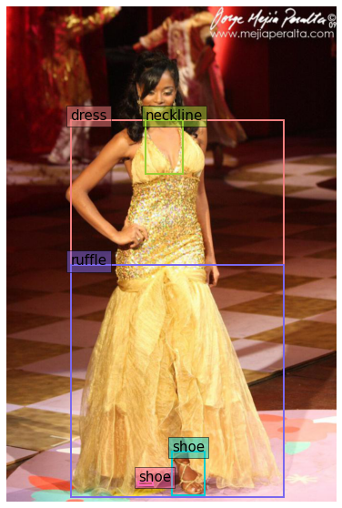

<a href="https://colab.research.google.com/github/valntinaf/fine_tunning_YOLOS_for_fashion/blob/main/Fine_tunning_YOLOs_for_fashion.ipynb" target="_parent"></a>

First of all we are going to install a couple of libraries needed for interacting with Hugging Face. We are going to use HuggingFace for downloading a pretrained model and a dataset we will use for fine-tunning it.

- Lighting: PyTorch Lighting will provide a high-level interface for PyTorch, a popular machine learning framework.
- Datasets: A library for interacting with uploaded datasets available on the Hugging Face Hub.
- Transformers: A library for interacting with pre-trained models available on the Hugging Face Hub.


```python
!pip install lightning==1.8.6
!pip install transformers==4.23.1
!pip install datasets==2.6.1
!pip install huggingface-hub==0.11.1
```

    Looking in indexes: https://pypi.org/simple, https://us-python.pkg.dev/colab-wheels/public/simple/
    Collecting lightning==1.8.6
      Downloading lightning-1.8.6-py3-none-any.whl (1.8 MB)
         |████████████████████████████████| 1.8 MB 4.1 MB/s 
    [?25hCollecting deepdiff>=5.7.0
      Downloading deepdiff-6.2.2-py3-none-any.whl (72 kB)
         |████████████████████████████████| 72 kB 733 kB/s 
    [?25hRequirement already satisfied: PyYAML>=5.4 in /usr/local/lib/python3.8/dist-packages (from lightning==1.8.6) (6.0)
    Requirement already satisfied: aiohttp>=3.8.0 in /usr/local/lib/python3.8/dist-packages (from lightning==1.8.6) (3.8.3)
    Requirement already satisfied: tqdm>=4.57.0 in /usr/local/lib/python3.8/dist-packages (from lightning==1.8.6) (4.64.1)
    Requirement already satisfied: psutil in /usr/local/lib/python3.8/dist-packages (from lightning==1.8.6) (5.4.8)
    Requirement already satisfied: packaging in /usr/local/lib/python3.8/dist-packages (from lightning==1.8.6) (21.3)
    Collecting arrow>=1.2.0
      Downloading arrow-1.2.3-py3-none-any.whl (66 kB)
         |████████████████████████████████| 66 kB 4.0 MB/s 
    [?25hCollecting lightning-cloud>=0.5.12
      Downloading lightning_cloud-0.5.15-py3-none-any.whl (373 kB)
         |████████████████████████████████| 373 kB 61.1 MB/s 
    [?25hRequirement already satisfied: fsspec>=2022.5.0 in /usr/local/lib/python3.8/dist-packages (from lightning==1.8.6) (2022.11.0)
    Requirement already satisfied: typing-extensions>=4.0.0 in /usr/local/lib/python3.8/dist-packages (from lightning==1.8.6) (4.4.0)
    Collecting croniter<1.4.0,>=1.3.0
      Downloading croniter-1.3.8-py2.py3-none-any.whl (18 kB)
    Requirement already satisfied: traitlets>=5.3.0 in /usr/local/lib/python3.8/dist-packages (from lightning==1.8.6) (5.7.1)
    Requirement already satisfied: torch>=1.9.0 in /usr/local/lib/python3.8/dist-packages (from lightning==1.8.6) (1.13.0+cu116)
    Requirement already satisfied: numpy>=1.17.2 in /usr/local/lib/python3.8/dist-packages (from lightning==1.8.6) (1.21.6)
    Collecting starsessions<2.0,>=1.2.1
      Downloading starsessions-1.3.0-py3-none-any.whl (10 kB)
    Requirement already satisfied: click in /usr/local/lib/python3.8/dist-packages (from lightning==1.8.6) (7.1.2)
    Collecting lightning-utilities!=0.4.0,>=0.3.0
      Downloading lightning_utilities-0.5.0-py3-none-any.whl (18 kB)
    Collecting tensorboardX>=2.2
      Downloading tensorboardX-2.5.1-py2.py3-none-any.whl (125 kB)
         |████████████████████████████████| 125 kB 57.9 MB/s 
    [?25hCollecting beautifulsoup4>=4.8.0
      Downloading beautifulsoup4-4.11.1-py3-none-any.whl (128 kB)
         |████████████████████████████████| 128 kB 61.9 MB/s 
    [?25hCollecting torchmetrics>=0.7.0
      Downloading torchmetrics-0.11.0-py3-none-any.whl (512 kB)
         |████████████████████████████████| 512 kB 61.4 MB/s 
    [?25hCollecting inquirer>=2.10.0
      Downloading inquirer-3.1.1-py3-none-any.whl (17 kB)
    Requirement already satisfied: charset-normalizer<3.0,>=2.0 in /usr/local/lib/python3.8/dist-packages (from aiohttp>=3.8.0->lightning==1.8.6) (2.1.1)
    Requirement already satisfied: attrs>=17.3.0 in /usr/local/lib/python3.8/dist-packages (from aiohttp>=3.8.0->lightning==1.8.6) (22.1.0)
    Requirement already satisfied: yarl<2.0,>=1.0 in /usr/local/lib/python3.8/dist-packages (from aiohttp>=3.8.0->lightning==1.8.6) (1.8.2)
    Requirement already satisfied: frozenlist>=1.1.1 in /usr/local/lib/python3.8/dist-packages (from aiohttp>=3.8.0->lightning==1.8.6) (1.3.3)
    Requirement already satisfied: async-timeout<5.0,>=4.0.0a3 in /usr/local/lib/python3.8/dist-packages (from aiohttp>=3.8.0->lightning==1.8.6) (4.0.2)
    Requirement already satisfied: multidict<7.0,>=4.5 in /usr/local/lib/python3.8/dist-packages (from aiohttp>=3.8.0->lightning==1.8.6) (6.0.3)
    Requirement already satisfied: aiosignal>=1.1.2 in /usr/local/lib/python3.8/dist-packages (from aiohttp>=3.8.0->lightning==1.8.6) (1.3.1)
    Requirement already satisfied: python-dateutil>=2.7.0 in /usr/local/lib/python3.8/dist-packages (from arrow>=1.2.0->lightning==1.8.6) (2.8.2)
    Collecting soupsieve>1.2
      Downloading soupsieve-2.3.2.post1-py3-none-any.whl (37 kB)
    Collecting ordered-set<4.2.0,>=4.0.2
      Downloading ordered_set-4.1.0-py3-none-any.whl (7.6 kB)
    Requirement already satisfied: requests in /usr/local/lib/python3.8/dist-packages (from fsspec>=2022.5.0->lightning==1.8.6) (2.23.0)
    Collecting readchar>=3.0.6
      Downloading readchar-4.0.3-py3-none-any.whl (8.4 kB)
    Collecting blessed>=1.19.0
      Downloading blessed-1.19.1-py2.py3-none-any.whl (58 kB)
         |████████████████████████████████| 58 kB 6.0 MB/s 
    [?25hCollecting python-editor>=1.0.4
      Downloading python_editor-1.0.4-py3-none-any.whl (4.9 kB)
    Requirement already satisfied: wcwidth>=0.1.4 in /usr/local/lib/python3.8/dist-packages (from blessed>=1.19.0->inquirer>=2.10.0->lightning==1.8.6) (0.2.5)
    Requirement already satisfied: six>=1.9.0 in /usr/local/lib/python3.8/dist-packages (from blessed>=1.19.0->inquirer>=2.10.0->lightning==1.8.6) (1.15.0)
    Collecting fastapi[all]
      Downloading fastapi-0.88.0-py3-none-any.whl (55 kB)
         |████████████████████████████████| 55 kB 4.3 MB/s 
    [?25hCollecting rich
      Downloading rich-13.0.0-py3-none-any.whl (238 kB)
         |████████████████████████████████| 238 kB 76.5 MB/s 
    [?25hRequirement already satisfied: urllib3 in /usr/local/lib/python3.8/dist-packages (from lightning-cloud>=0.5.12->lightning==1.8.6) (1.24.3)
    Collecting pyjwt
      Downloading PyJWT-2.6.0-py3-none-any.whl (20 kB)
    Collecting websocket-client
      Downloading websocket_client-1.4.2-py3-none-any.whl (55 kB)
         |████████████████████████████████| 55 kB 4.5 MB/s 
    [?25hRequirement already satisfied: pyparsing!=3.0.5,>=2.0.2 in /usr/local/lib/python3.8/dist-packages (from packaging->lightning==1.8.6) (3.0.9)
    Requirement already satisfied: setuptools>=41.0 in /usr/local/lib/python3.8/dist-packages (from readchar>=3.0.6->inquirer>=2.10.0->lightning==1.8.6) (57.4.0)
    Collecting starlette<1,>=0
      Downloading starlette-0.23.1-py3-none-any.whl (64 kB)
         |████████████████████████████████| 64 kB 3.5 MB/s 
    [?25hCollecting itsdangerous<3.0.0,>=2.0.1
      Downloading itsdangerous-2.1.2-py3-none-any.whl (15 kB)
    Collecting anyio<5,>=3.4.0
      Downloading anyio-3.6.2-py3-none-any.whl (80 kB)
         |████████████████████████████████| 80 kB 10.9 MB/s 
    [?25hRequirement already satisfied: idna>=2.8 in /usr/local/lib/python3.8/dist-packages (from anyio<5,>=3.4.0->starlette<1,>=0->starsessions<2.0,>=1.2.1->lightning==1.8.6) (2.10)
    Collecting sniffio>=1.1
      Downloading sniffio-1.3.0-py3-none-any.whl (10 kB)
    Requirement already satisfied: protobuf<=3.20.1,>=3.8.0 in /usr/local/lib/python3.8/dist-packages (from tensorboardX>=2.2->lightning==1.8.6) (3.19.6)
    Requirement already satisfied: pydantic!=1.7,!=1.7.1,!=1.7.2,!=1.7.3,!=1.8,!=1.8.1,<2.0.0,>=1.6.2 in /usr/local/lib/python3.8/dist-packages (from fastapi[all]->lightning-cloud>=0.5.12->lightning==1.8.6) (1.10.2)
    Collecting starlette<1,>=0
      Downloading starlette-0.22.0-py3-none-any.whl (64 kB)
         |████████████████████████████████| 64 kB 3.2 MB/s 
    [?25hRequirement already satisfied: jinja2>=2.11.2 in /usr/local/lib/python3.8/dist-packages (from fastapi[all]->lightning-cloud>=0.5.12->lightning==1.8.6) (2.11.3)
    Collecting uvicorn[standard]>=0.12.0
      Downloading uvicorn-0.20.0-py3-none-any.whl (56 kB)
         |████████████████████████████████| 56 kB 5.8 MB/s 
    [?25hCollecting python-multipart>=0.0.5
      Downloading python-multipart-0.0.5.tar.gz (32 kB)
    Collecting email-validator>=1.1.1
      Downloading email_validator-1.3.0-py2.py3-none-any.whl (22 kB)
    Collecting httpx>=0.23.0
      Downloading httpx-0.23.1-py3-none-any.whl (84 kB)
         |████████████████████████████████| 84 kB 3.1 MB/s 
    [?25hCollecting orjson>=3.2.1
      Downloading orjson-3.8.3-cp38-cp38-manylinux_2_17_x86_64.manylinux2014_x86_64.whl (278 kB)
         |████████████████████████████████| 278 kB 79.6 MB/s 
    [?25hCollecting ujson!=4.0.2,!=4.1.0,!=4.2.0,!=4.3.0,!=5.0.0,!=5.1.0,>=4.0.1
      Downloading ujson-5.6.0-cp38-cp38-manylinux_2_17_x86_64.manylinux2014_x86_64.whl (52 kB)
         |████████████████████████████████| 52 kB 1.5 MB/s 
    [?25hRequirement already satisfied: dnspython>=1.15.0 in /usr/local/lib/python3.8/dist-packages (from email-validator>=1.1.1->fastapi[all]->lightning-cloud>=0.5.12->lightning==1.8.6) (2.2.1)
    Collecting rfc3986[idna2008]<2,>=1.3
      Downloading rfc3986-1.5.0-py2.py3-none-any.whl (31 kB)
    Collecting httpcore<0.17.0,>=0.15.0
      Downloading httpcore-0.16.3-py3-none-any.whl (69 kB)
         |████████████████████████████████| 69 kB 8.6 MB/s 
    [?25hRequirement already satisfied: certifi in /usr/local/lib/python3.8/dist-packages (from httpx>=0.23.0->fastapi[all]->lightning-cloud>=0.5.12->lightning==1.8.6) (2022.12.7)
    Collecting h11<0.15,>=0.13
      Downloading h11-0.14.0-py3-none-any.whl (58 kB)
         |████████████████████████████████| 58 kB 7.0 MB/s 
    [?25hRequirement already satisfied: MarkupSafe>=0.23 in /usr/local/lib/python3.8/dist-packages (from jinja2>=2.11.2->fastapi[all]->lightning-cloud>=0.5.12->lightning==1.8.6) (2.0.1)
    Collecting httptools>=0.5.0
      Downloading httptools-0.5.0-cp38-cp38-manylinux_2_5_x86_64.manylinux1_x86_64.manylinux_2_17_x86_64.manylinux2014_x86_64.whl (427 kB)
         |████████████████████████████████| 427 kB 74.3 MB/s 
    [?25hCollecting websockets>=10.4
      Downloading websockets-10.4-cp38-cp38-manylinux_2_5_x86_64.manylinux1_x86_64.manylinux_2_17_x86_64.manylinux2014_x86_64.whl (106 kB)
         |████████████████████████████████| 106 kB 74.2 MB/s 
    [?25hCollecting uvloop!=0.15.0,!=0.15.1,>=0.14.0
      Downloading uvloop-0.17.0-cp38-cp38-manylinux_2_17_x86_64.manylinux2014_x86_64.whl (4.6 MB)
         |████████████████████████████████| 4.6 MB 58.5 MB/s 
    [?25hCollecting watchfiles>=0.13
      Downloading watchfiles-0.18.1-cp37-abi3-manylinux_2_17_x86_64.manylinux2014_x86_64.whl (1.2 MB)
         |████████████████████████████████| 1.2 MB 54.7 MB/s 
    [?25hCollecting python-dotenv>=0.13
      Downloading python_dotenv-0.21.0-py3-none-any.whl (18 kB)
    Requirement already satisfied: chardet<4,>=3.0.2 in /usr/local/lib/python3.8/dist-packages (from requests->fsspec>=2022.5.0->lightning==1.8.6) (3.0.4)
    Requirement already satisfied: pygments<3.0.0,>=2.6.0 in /usr/local/lib/python3.8/dist-packages (from rich->lightning-cloud>=0.5.12->lightning==1.8.6) (2.6.1)
    Collecting commonmark<0.10.0,>=0.9.0
      Downloading commonmark-0.9.1-py2.py3-none-any.whl (51 kB)
         |████████████████████████████████| 51 kB 7.8 MB/s 
    [?25hBuilding wheels for collected packages: python-multipart
      Building wheel for python-multipart (setup.py) ... [?25l[?25hdone
      Created wheel for python-multipart: filename=python_multipart-0.0.5-py3-none-any.whl size=31678 sha256=cadb0911d1aae88e30255fd7393e71efdec70f23937a6a7f4d29a5837902ce2a
      Stored in directory: /root/.cache/pip/wheels/9e/fc/1c/cf980e6413d3ee8e70cd8f39e2366b0f487e3e221aeb452eb0
    Successfully built python-multipart
    Installing collected packages: sniffio, rfc3986, h11, anyio, websockets, watchfiles, uvloop, uvicorn, starlette, python-dotenv, httptools, httpcore, ujson, python-multipart, orjson, itsdangerous, httpx, fastapi, email-validator, commonmark, websocket-client, soupsieve, rich, readchar, python-editor, pyjwt, ordered-set, blessed, torchmetrics, tensorboardX, starsessions, lightning-utilities, lightning-cloud, inquirer, deepdiff, croniter, beautifulsoup4, arrow, lightning
      Attempting uninstall: itsdangerous
        Found existing installation: itsdangerous 1.1.0
        Uninstalling itsdangerous-1.1.0:
          Successfully uninstalled itsdangerous-1.1.0
      Attempting uninstall: beautifulsoup4
        Found existing installation: beautifulsoup4 4.6.3
        Uninstalling beautifulsoup4-4.6.3:
          Successfully uninstalled beautifulsoup4-4.6.3
    ERROR: pip's dependency resolver does not currently take into account all the packages that are installed. This behaviour is the source of the following dependency conflicts.
    flask 1.1.4 requires itsdangerous<2.0,>=0.24, but you have itsdangerous 2.1.2 which is incompatible.
    Successfully installed anyio-3.6.2 arrow-1.2.3 beautifulsoup4-4.11.1 blessed-1.19.1 commonmark-0.9.1 croniter-1.3.8 deepdiff-6.2.2 email-validator-1.3.0 fastapi-0.88.0 h11-0.14.0 httpcore-0.16.3 httptools-0.5.0 httpx-0.23.1 inquirer-3.1.1 itsdangerous-2.1.2 lightning-1.8.6 lightning-cloud-0.5.15 lightning-utilities-0.5.0 ordered-set-4.1.0 orjson-3.8.3 pyjwt-2.6.0 python-dotenv-0.21.0 python-editor-1.0.4 python-multipart-0.0.5 readchar-4.0.3 rfc3986-1.5.0 rich-13.0.0 sniffio-1.3.0 soupsieve-2.3.2.post1 starlette-0.22.0 starsessions-1.3.0 tensorboardX-2.5.1 torchmetrics-0.11.0 ujson-5.6.0 uvicorn-0.20.0 uvloop-0.17.0 watchfiles-0.18.1 websocket-client-1.4.2 websockets-10.4
    Looking in indexes: https://pypi.org/simple, https://us-python.pkg.dev/colab-wheels/public/simple/
    Collecting transformers==4.23.1
      Downloading transformers-4.23.1-py3-none-any.whl (5.3 MB)
         |████████████████████████████████| 5.3 MB 4.6 MB/s 
    [?25hRequirement already satisfied: regex!=2019.12.17 in /usr/local/lib/python3.8/dist-packages (from transformers==4.23.1) (2022.6.2)
    Requirement already satisfied: tqdm>=4.27 in /usr/local/lib/python3.8/dist-packages (from transformers==4.23.1) (4.64.1)
    Requirement already satisfied: filelock in /usr/local/lib/python3.8/dist-packages (from transformers==4.23.1) (3.8.2)
    Collecting tokenizers!=0.11.3,<0.14,>=0.11.1
      Downloading tokenizers-0.13.2-cp38-cp38-manylinux_2_17_x86_64.manylinux2014_x86_64.whl (7.6 MB)
         |████████████████████████████████| 7.6 MB 63.7 MB/s 
    [?25hRequirement already satisfied: numpy>=1.17 in /usr/local/lib/python3.8/dist-packages (from transformers==4.23.1) (1.21.6)
    Requirement already satisfied: requests in /usr/local/lib/python3.8/dist-packages (from transformers==4.23.1) (2.23.0)
    Collecting huggingface-hub<1.0,>=0.10.0
      Downloading huggingface_hub-0.11.1-py3-none-any.whl (182 kB)
         |████████████████████████████████| 182 kB 78.5 MB/s 
    [?25hRequirement already satisfied: pyyaml>=5.1 in /usr/local/lib/python3.8/dist-packages (from transformers==4.23.1) (6.0)
    Requirement already satisfied: packaging>=20.0 in /usr/local/lib/python3.8/dist-packages (from transformers==4.23.1) (21.3)
    Requirement already satisfied: typing-extensions>=3.7.4.3 in /usr/local/lib/python3.8/dist-packages (from huggingface-hub<1.0,>=0.10.0->transformers==4.23.1) (4.4.0)
    Requirement already satisfied: pyparsing!=3.0.5,>=2.0.2 in /usr/local/lib/python3.8/dist-packages (from packaging>=20.0->transformers==4.23.1) (3.0.9)
    Requirement already satisfied: urllib3!=1.25.0,!=1.25.1,<1.26,>=1.21.1 in /usr/local/lib/python3.8/dist-packages (from requests->transformers==4.23.1) (1.24.3)
    Requirement already satisfied: idna<3,>=2.5 in /usr/local/lib/python3.8/dist-packages (from requests->transformers==4.23.1) (2.10)
    Requirement already satisfied: certifi>=2017.4.17 in /usr/local/lib/python3.8/dist-packages (from requests->transformers==4.23.1) (2022.12.7)
    Requirement already satisfied: chardet<4,>=3.0.2 in /usr/local/lib/python3.8/dist-packages (from requests->transformers==4.23.1) (3.0.4)
    Installing collected packages: tokenizers, huggingface-hub, transformers
    Successfully installed huggingface-hub-0.11.1 tokenizers-0.13.2 transformers-4.23.1
    Looking in indexes: https://pypi.org/simple, https://us-python.pkg.dev/colab-wheels/public/simple/
    Collecting datasets==2.6.1
      Downloading datasets-2.6.1-py3-none-any.whl (441 kB)
         |████████████████████████████████| 441 kB 4.4 MB/s 
    [?25hCollecting multiprocess
      Downloading multiprocess-0.70.14-py38-none-any.whl (132 kB)
         |████████████████████████████████| 132 kB 75.9 MB/s 
    [?25hRequirement already satisfied: pyyaml>=5.1 in /usr/local/lib/python3.8/dist-packages (from datasets==2.6.1) (6.0)
    Requirement already satisfied: numpy>=1.17 in /usr/local/lib/python3.8/dist-packages (from datasets==2.6.1) (1.21.6)
    Requirement already satisfied: fsspec[http]>=2021.11.1 in /usr/local/lib/python3.8/dist-packages (from datasets==2.6.1) (2022.11.0)
    Requirement already satisfied: huggingface-hub<1.0.0,>=0.2.0 in /usr/local/lib/python3.8/dist-packages (from datasets==2.6.1) (0.11.1)
    Requirement already satisfied: packaging in /usr/local/lib/python3.8/dist-packages (from datasets==2.6.1) (21.3)
    Requirement already satisfied: pandas in /usr/local/lib/python3.8/dist-packages (from datasets==2.6.1) (1.3.5)
    Collecting dill<0.3.6
      Downloading dill-0.3.5.1-py2.py3-none-any.whl (95 kB)
         |████████████████████████████████| 95 kB 6.0 MB/s 
    [?25hRequirement already satisfied: pyarrow>=6.0.0 in /usr/local/lib/python3.8/dist-packages (from datasets==2.6.1) (9.0.0)
    Requirement already satisfied: tqdm>=4.62.1 in /usr/local/lib/python3.8/dist-packages (from datasets==2.6.1) (4.64.1)
    Requirement already satisfied: aiohttp in /usr/local/lib/python3.8/dist-packages (from datasets==2.6.1) (3.8.3)
    Collecting xxhash
      Downloading xxhash-3.2.0-cp38-cp38-manylinux_2_17_x86_64.manylinux2014_x86_64.whl (213 kB)
         |████████████████████████████████| 213 kB 65.6 MB/s 
    [?25hCollecting responses<0.19
      Downloading responses-0.18.0-py3-none-any.whl (38 kB)
    Requirement already satisfied: requests>=2.19.0 in /usr/local/lib/python3.8/dist-packages (from datasets==2.6.1) (2.23.0)
    Requirement already satisfied: charset-normalizer<3.0,>=2.0 in /usr/local/lib/python3.8/dist-packages (from aiohttp->datasets==2.6.1) (2.1.1)
    Requirement already satisfied: yarl<2.0,>=1.0 in /usr/local/lib/python3.8/dist-packages (from aiohttp->datasets==2.6.1) (1.8.2)
    Requirement already satisfied: multidict<7.0,>=4.5 in /usr/local/lib/python3.8/dist-packages (from aiohttp->datasets==2.6.1) (6.0.3)
    Requirement already satisfied: attrs>=17.3.0 in /usr/local/lib/python3.8/dist-packages (from aiohttp->datasets==2.6.1) (22.1.0)
    Requirement already satisfied: async-timeout<5.0,>=4.0.0a3 in /usr/local/lib/python3.8/dist-packages (from aiohttp->datasets==2.6.1) (4.0.2)
    Requirement already satisfied: frozenlist>=1.1.1 in /usr/local/lib/python3.8/dist-packages (from aiohttp->datasets==2.6.1) (1.3.3)
    Requirement already satisfied: aiosignal>=1.1.2 in /usr/local/lib/python3.8/dist-packages (from aiohttp->datasets==2.6.1) (1.3.1)
    Requirement already satisfied: filelock in /usr/local/lib/python3.8/dist-packages (from huggingface-hub<1.0.0,>=0.2.0->datasets==2.6.1) (3.8.2)
    Requirement already satisfied: typing-extensions>=3.7.4.3 in /usr/local/lib/python3.8/dist-packages (from huggingface-hub<1.0.0,>=0.2.0->datasets==2.6.1) (4.4.0)
    Requirement already satisfied: pyparsing!=3.0.5,>=2.0.2 in /usr/local/lib/python3.8/dist-packages (from packaging->datasets==2.6.1) (3.0.9)
    Requirement already satisfied: idna<3,>=2.5 in /usr/local/lib/python3.8/dist-packages (from requests>=2.19.0->datasets==2.6.1) (2.10)
    Requirement already satisfied: urllib3!=1.25.0,!=1.25.1,<1.26,>=1.21.1 in /usr/local/lib/python3.8/dist-packages (from requests>=2.19.0->datasets==2.6.1) (1.24.3)
    Requirement already satisfied: chardet<4,>=3.0.2 in /usr/local/lib/python3.8/dist-packages (from requests>=2.19.0->datasets==2.6.1) (3.0.4)
    Requirement already satisfied: certifi>=2017.4.17 in /usr/local/lib/python3.8/dist-packages (from requests>=2.19.0->datasets==2.6.1) (2022.12.7)
    Collecting urllib3!=1.25.0,!=1.25.1,<1.26,>=1.21.1
      Downloading urllib3-1.25.11-py2.py3-none-any.whl (127 kB)
         |████████████████████████████████| 127 kB 68.0 MB/s 
    [?25hCollecting multiprocess
      Downloading multiprocess-0.70.13-py38-none-any.whl (131 kB)
         |████████████████████████████████| 131 kB 77.6 MB/s 
    [?25hRequirement already satisfied: python-dateutil>=2.7.3 in /usr/local/lib/python3.8/dist-packages (from pandas->datasets==2.6.1) (2.8.2)
    Requirement already satisfied: pytz>=2017.3 in /usr/local/lib/python3.8/dist-packages (from pandas->datasets==2.6.1) (2022.6)
    Requirement already satisfied: six>=1.5 in /usr/local/lib/python3.8/dist-packages (from python-dateutil>=2.7.3->pandas->datasets==2.6.1) (1.15.0)
    Installing collected packages: urllib3, dill, xxhash, responses, multiprocess, datasets
      Attempting uninstall: urllib3
        Found existing installation: urllib3 1.24.3
        Uninstalling urllib3-1.24.3:
          Successfully uninstalled urllib3-1.24.3
      Attempting uninstall: dill
        Found existing installation: dill 0.3.6
        Uninstalling dill-0.3.6:
          Successfully uninstalled dill-0.3.6
    Successfully installed datasets-2.6.1 dill-0.3.5.1 multiprocess-0.70.13 responses-0.18.0 urllib3-1.25.11 xxhash-3.2.0
    Looking in indexes: https://pypi.org/simple, https://us-python.pkg.dev/colab-wheels/public/simple/
    Requirement already satisfied: huggingface-hub==0.11.1 in /usr/local/lib/python3.8/dist-packages (0.11.1)
    Requirement already satisfied: packaging>=20.9 in /usr/local/lib/python3.8/dist-packages (from huggingface-hub==0.11.1) (21.3)
    Requirement already satisfied: typing-extensions>=3.7.4.3 in /usr/local/lib/python3.8/dist-packages (from huggingface-hub==0.11.1) (4.4.0)
    Requirement already satisfied: requests in /usr/local/lib/python3.8/dist-packages (from huggingface-hub==0.11.1) (2.23.0)
    Requirement already satisfied: tqdm in /usr/local/lib/python3.8/dist-packages (from huggingface-hub==0.11.1) (4.64.1)
    Requirement already satisfied: pyyaml>=5.1 in /usr/local/lib/python3.8/dist-packages (from huggingface-hub==0.11.1) (6.0)
    Requirement already satisfied: filelock in /usr/local/lib/python3.8/dist-packages (from huggingface-hub==0.11.1) (3.8.2)
    Requirement already satisfied: pyparsing!=3.0.5,>=2.0.2 in /usr/local/lib/python3.8/dist-packages (from packaging>=20.9->huggingface-hub==0.11.1) (3.0.9)
    Requirement already satisfied: idna<3,>=2.5 in /usr/local/lib/python3.8/dist-packages (from requests->huggingface-hub==0.11.1) (2.10)
    Requirement already satisfied: chardet<4,>=3.0.2 in /usr/local/lib/python3.8/dist-packages (from requests->huggingface-hub==0.11.1) (3.0.4)
    Requirement already satisfied: certifi>=2017.4.17 in /usr/local/lib/python3.8/dist-packages (from requests->huggingface-hub==0.11.1) (2022.12.7)
    Requirement already satisfied: urllib3!=1.25.0,!=1.25.1,<1.26,>=1.21.1 in /usr/local/lib/python3.8/dist-packages (from requests->huggingface-hub==0.11.1) (1.25.11)


```python
!python -V
```

    Python 3.8.16


```python
!huggingface-cli login
```

    
        _|    _|  _|    _|    _|_|_|    _|_|_|  _|_|_|  _|      _|    _|_|_|      _|_|_|_|    _|_|      _|_|_|  _|_|_|_|
        _|    _|  _|    _|  _|        _|          _|    _|_|    _|  _|            _|        _|    _|  _|        _|
        _|_|_|_|  _|    _|  _|  _|_|  _|  _|_|    _|    _|  _|  _|  _|  _|_|      _|_|_|    _|_|_|_|  _|        _|_|_|
        _|    _|  _|    _|  _|    _|  _|    _|    _|    _|    _|_|  _|    _|      _|        _|    _|  _|        _|
        _|    _|    _|_|      _|_|_|    _|_|_|  _|_|_|  _|      _|    _|_|_|      _|        _|    _|    _|_|_|  _|_|_|_|
    
        To login, `huggingface_hub` now requires a token generated from https://huggingface.co/settings/tokens .
        
    Token: 
    Add token as git credential? (Y/n) n
    Token is valid.
    Your token has been saved to /root/.huggingface/token
    Login successful


```python
import datasets
import lightning as pl
from lightning import Trainer
from torch.utils.data import DataLoader
from torchvision import transforms
from transformers import AutoFeatureExtractor
from transformers import AutoModelForObjectDetection
import matplotlib.pyplot as plt
import torch
import random
```


```python
def xyxy_to_xcycwh(box):
    x1, y1, x2, y2 = box.unbind(dim=1)
    width = x2-x1
    height = y2-y1
    xc = x1 + width*0.5
    yc = y1 + height*0.5
    b = [xc, yc, width, height]
    return torch.stack(b, dim=1)

def cxcywh_to_xyxy(x):
    x_c, y_c, w, h = x.unbind(1)
    x1 = x_c - 0.5 * w
    y1 = y_c - 0.5 * h
    x2 = x_c + 0.5 * w
    y2 = y_c + 0.5 * h
    b = [x1, y1, x2, y2]
    return torch.stack(b, dim=1)
```


```python
COLORS = ['lightcoral', 'yellowgreen', 'darkturquoise', 'hotpink', 'mediumslateblue']

def rescale_bboxes(out_bbox, size, down=True):
    img_w, img_h = size
    if down:
        b = torch.Tensor(out_bbox) / torch.tensor([img_w, img_h, img_w, img_h], dtype=torch.float32)
    if not down:
        b = torch.Tensor(out_bbox) * torch.tensor([img_w, img_h, img_w, img_h], dtype=torch.float32)
    return b

def plot_results(pil_img, boxes, class_labels):
    plt.figure(figsize=(16,10))
    plt.imshow(pil_img)
    ax = plt.gca()
    colors = COLORS * 100
    for (xmin, ymin, xmax, ymax), c, label in zip(boxes, colors, class_labels):
        ax.add_patch(plt.Rectangle((xmin, ymin), xmax - xmin, ymax - ymin,
                                   fill=False, color=c, linewidth=2))
        ax.text(xmin, ymin, str(label), fontsize=15,
                bbox=dict(facecolor=c, alpha=0.5))
    plt.axis('off')
    plt.show()
```

## Downloading and visualizing the fashionpedia dataset


```python
train_dataset = datasets.load_dataset("detection-datasets/fashionpedia", split=datasets.ReadInstruction("train",from_=0, to=19, unit="%", rounding="pct1_dropremainder"))
val_dataset = datasets.load_dataset("detection-datasets/fashionpedia", split=datasets.ReadInstruction("train",from_=19, to=21, unit="%", rounding="pct1_dropremainder"))
```


    Downloading metadata:   0%|          | 0.00/1.78k [00:00<?, ?B/s]


    Downloading readme:   0%|          | 0.00/5.22k [00:00<?, ?B/s]


    WARNING:datasets.builder:Using custom data configuration detection-datasets--fashionpedia-fd367b48ab385b58


    Downloading and preparing dataset None/None (download: 3.24 GiB, generated: 3.12 GiB, post-processed: Unknown size, total: 6.36 GiB) to /root/.cache/huggingface/datasets/detection-datasets___parquet/detection-datasets--fashionpedia-fd367b48ab385b58/0.0.0/2a3b91fbd88a2c90d1dbbb32b460cf621d31bd5b05b934492fdef7d8d6f236ec...


    Downloading data files:   0%|          | 0/2 [00:00<?, ?it/s]


    Downloading data:   0%|          | 0.00/84.8M [00:00<?, ?B/s]


    Downloading data:   0%|          | 0.00/482M [00:00<?, ?B/s]


    Downloading data:   0%|          | 0.00/480M [00:00<?, ?B/s]


    Downloading data:   0%|          | 0.00/480M [00:00<?, ?B/s]


    Downloading data:   0%|          | 0.00/490M [00:00<?, ?B/s]


    Downloading data:   0%|          | 0.00/488M [00:00<?, ?B/s]


    Downloading data:   0%|          | 0.00/487M [00:00<?, ?B/s]


    Downloading data:   0%|          | 0.00/487M [00:00<?, ?B/s]


    Extracting data files:   0%|          | 0/2 [00:00<?, ?it/s]


    0 tables [00:00, ? tables/s]


    0 tables [00:00, ? tables/s]


    Dataset parquet downloaded and prepared to /root/.cache/huggingface/datasets/detection-datasets___parquet/detection-datasets--fashionpedia-fd367b48ab385b58/0.0.0/2a3b91fbd88a2c90d1dbbb32b460cf621d31bd5b05b934492fdef7d8d6f236ec. Subsequent calls will reuse this data.


    WARNING:datasets.builder:Using custom data configuration detection-datasets--fashionpedia-fd367b48ab385b58
    WARNING:datasets.builder:Found cached dataset parquet (/root/.cache/huggingface/datasets/detection-datasets___parquet/detection-datasets--fashionpedia-fd367b48ab385b58/0.0.0/2a3b91fbd88a2c90d1dbbb32b460cf621d31bd5b05b934492fdef7d8d6f236ec)


```python
cats = train_dataset.features['objects'].feature['category']
cats

def idx_to_text(indexes):
    labels = []
    for i in indexes:
        labels.append(cats.names[i])
    return labels
```


```python
train_dataset
```


    Dataset({
        features: ['image_id', 'image', 'width', 'height', 'objects'],
        num_rows: 8664
    })


```python
val_dataset
```


    Dataset({
        features: ['image_id', 'image', 'width', 'height', 'objects'],
        num_rows: 912
    })


```python
random_i = random.randint(0, train_dataset.num_rows)
print(f"Plotting random item {random_i}")
random_item = train_dataset[random_i]
plot_results(random_item['image'], random_item['objects']['bbox'], idx_to_text(random_item['objects']['category']))
```

    Plotting random item 1423


    

    


### Preprocessing our dataset


```python
# In order to use our images for the training, we're going to preprocess them, it is possible to use the YOLOs preprocessor.
feature_extractor = AutoFeatureExtractor.from_pretrained("hustvl/yolos-small", size=816, max_size=864)
```


    Downloading:   0%|          | 0.00/275 [00:00<?, ?B/s]


```python
def transform(batch):
    inputs = {}
    inputs['pixel_values'] = feature_extractor(batch['image'], return_tensors='pt')['pixel_values']
    labels = []
    bbox = [rescale_bboxes(batch['objects'][i]['bbox'], (batch['width'][i], batch['height'][i])) for i in range(len(batch['objects']))]
    bbox = [xyxy_to_xcycwh(torch.Tensor(bbox_i)) for bbox_i in bbox]
    labels.append({
        "boxes": bbox,
        "class_labels": [object['category'] for object in batch['objects']],
        "image_id": torch.Tensor([batch['image_id']]).int(),
        "area": [object['area'] for object in batch['objects']],
        "iscrowd": torch.Tensor([0 for _ in batch['objects']]).int(),
        "orig_size": torch.Tensor([(batch['width'], batch['height'])]).int(),
        "size": torch.Tensor([inputs['pixel_values'].shape[1:]])[0].int(),
    })
    inputs['labels'] = labels
    return inputs
```


```python
prepared_train = train_dataset.with_transform(transform)
prepared_val = val_dataset.with_transform(transform)
```


```python
def collate_fn(batch):
    collated = {}
    collated["pixel_values"] = feature_extractor.pad([item['pixel_values'] for item in batch], return_tensors="pt")['pixel_values']
    collated["labels"] = []
    for item in batch:
        item['labels']['boxes'] = torch.stack(item['labels']['boxes'])[0]
        item['labels']['area'] = torch.Tensor(item['labels']['area'])
        item['labels']['class_labels'] = torch.Tensor(item['labels']['class_labels'])[0]
        item['labels']['class_labels'] = item['labels']['class_labels'].type(torch.LongTensor)
        collated["labels"].append(item['labels'])
    return collated
```


```python
print("Number of training examples:", len(train_dataset))
print("Number of validation examples:", len(val_dataset))
```

    Number of training examples: 8664
    Number of validation examples: 912


```python
BATCH_SIZE = 1
train_dataloader = DataLoader(prepared_train, collate_fn=collate_fn, batch_size=BATCH_SIZE)
val_dataloader = DataLoader(prepared_val, collate_fn=collate_fn, batch_size=BATCH_SIZE)
```


```python
item = next(iter(train_dataloader))
```


```python
item
```


    {'pixel_values': tensor([[[[-0.2856, -0.3541, -0.5767,  ...,  0.1426,  0.2282,  0.2282],
               [-0.1143, -0.2684, -0.3541,  ...,  0.2282,  0.2967,  0.2282],
               [-0.0287, -0.2856, -0.3541,  ..., -0.1486, -0.0801, -0.1143],
               ...,
               [ 1.8893,  1.9064,  1.9235,  ...,  2.1975,  2.2318,  2.2318],
               [ 1.9578,  1.9920,  2.0263,  ...,  2.1804,  2.2318,  2.2489],
               [ 2.0092,  2.0434,  2.0948,  ...,  2.0605,  2.1975,  2.2489]],
     
              [[-0.1625, -0.2325, -0.4601,  ...,  0.2927,  0.3803,  0.3803],
               [ 0.0126, -0.1450, -0.2325,  ...,  0.3803,  0.4503,  0.3803],
               [ 0.1001, -0.1625, -0.2325,  ..., -0.0049,  0.0651,  0.0301],
               ...,
               [ 1.5882,  1.6057,  1.6232,  ...,  2.2185,  2.2360,  2.2360],
               [ 1.6057,  1.6232,  1.6758,  ...,  2.1485,  2.2185,  2.2185],
               [ 1.6057,  1.6583,  1.7108,  ...,  2.0259,  2.1660,  2.2360]],
     
              [[-0.4275, -0.4798, -0.6890,  ...,  0.2348,  0.3219,  0.3219],
               [-0.2184, -0.3578, -0.4450,  ...,  0.3219,  0.3916,  0.3219],
               [-0.0790, -0.3404, -0.4101,  ..., -0.0615,  0.0082, -0.0267],
               ...,
               [ 0.8099,  0.8099,  0.8448,  ...,  0.3393,  0.3568,  0.3393],
               [ 0.6879,  0.7228,  0.7751,  ...,  0.2696,  0.3219,  0.3219],
               [ 0.6008,  0.6531,  0.7228,  ...,  0.1302,  0.2696,  0.3219]]]]),
     'labels': [{'boxes': tensor([[0.6965, 0.9243, 0.0880, 0.0713],
               [0.3834, 0.9443, 0.0660, 0.0527],
               [0.5015, 0.3096, 0.1290, 0.0684],
               [0.4824, 0.4624, 0.3490, 0.3740]]),
       'class_labels': tensor([23, 23, 33, 10]),
       'image_id': tensor([[23]], dtype=torch.int32),
       'area': tensor([[ 1422.,   843.,   373., 56375.]]),
       'iscrowd': tensor([0], dtype=torch.int32),
       'orig_size': tensor([[[ 682],
                [1024]]], dtype=torch.int32),
       'size': tensor([  3, 863, 575], dtype=torch.int32)}]}


```python
random_i = random.randint(0, BATCH_SIZE-1)
random_i = 0
pil_image = transforms.ToPILImage()(item['pixel_values'][random_i])
class_labels = item['labels'][random_i]['class_labels']
size = pil_image.size
boxes = rescale_bboxes(cxcywh_to_xyxy(item['labels'][random_i]['boxes']), size, down=False)
plot_results(pil_image, boxes, idx_to_text(class_labels.tolist()))
```


    

    


```python
class Detr(pl.LightningModule):

     def __init__(self, lr, weight_decay):
         super().__init__()
         self.model = AutoModelForObjectDetection.from_pretrained("valentinafeve/yolos-fashionpedia", 
                                                             num_labels=cats.num_classes,
                                                             ignore_mismatched_sizes=True)
         self.lr = lr
         self.weight_decay = weight_decay

     def forward(self, pixel_values):
       outputs = self.model(pixel_values=pixel_values)
       return outputs
     
     def common_step(self, batch, batch_idx):
       pixel_values = batch["pixel_values"]
       labels = [{k: v.to(self.device) for k, v in t.items()} for t in batch["labels"]]

       outputs = self.model(pixel_values=pixel_values, labels=labels)

       loss = outputs.loss
       loss_dict = outputs.loss_dict

       return loss, loss_dict

     def training_step(self, batch, batch_idx):
        loss, loss_dict = self.common_step(batch, batch_idx)     
        self.log("training_loss", loss)
        for k,v in loss_dict.items():
          self.log("train_" + k, v.item())

        return loss

     def validation_step(self, batch, batch_idx):
        loss, loss_dict = self.common_step(batch, batch_idx)     
        self.log("validation_loss", loss)
        for k,v in loss_dict.items():
          self.log("validation_" + k, v.item())

        return loss

     def configure_optimizers(self):
        optimizer = torch.optim.AdamW(self.parameters(), lr=self.lr,
                                  weight_decay=self.weight_decay)
        
        return optimizer

     def train_dataloader(self):
        return train_dataloader

     def val_dataloader(self):
        return val_dataloader
```


```python
# Start tensorboard.
%load_ext tensorboard
%tensorboard --logdir lightning_logs/
```


    <IPython.core.display.Javascript object>


Here we define the model, and verify the outputs.


```python
model = Detr(lr=2.5e-5, weight_decay=1e-4)
```


    Downloading:   0%|          | 0.00/2.71k [00:00<?, ?B/s]


    Downloading:   0%|          | 0.00/123M [00:00<?, ?B/s]


```python
model
```


    Detr(
      (model): YolosForObjectDetection(
        (vit): YolosModel(
          (embeddings): YolosEmbeddings(
            (patch_embeddings): YolosPatchEmbeddings(
              (projection): Conv2d(3, 384, kernel_size=(16, 16), stride=(16, 16))
            )
            (dropout): Dropout(p=0.0, inplace=False)
            (interpolation): InterpolateInitialPositionEmbeddings()
          )
          (encoder): YolosEncoder(
            (layer): ModuleList(
              (0): YolosLayer(
                (attention): YolosAttention(
                  (attention): YolosSelfAttention(
                    (query): Linear(in_features=384, out_features=384, bias=True)
                    (key): Linear(in_features=384, out_features=384, bias=True)
                    (value): Linear(in_features=384, out_features=384, bias=True)
                    (dropout): Dropout(p=0.0, inplace=False)
                  )
                  (output): YolosSelfOutput(
                    (dense): Linear(in_features=384, out_features=384, bias=True)
                    (dropout): Dropout(p=0.0, inplace=False)
                  )
                )
                (intermediate): YolosIntermediate(
                  (dense): Linear(in_features=384, out_features=1536, bias=True)
                  (intermediate_act_fn): GELUActivation()
                )
                (output): YolosOutput(
                  (dense): Linear(in_features=1536, out_features=384, bias=True)
                  (dropout): Dropout(p=0.0, inplace=False)
                )
                (layernorm_before): LayerNorm((384,), eps=1e-12, elementwise_affine=True)
                (layernorm_after): LayerNorm((384,), eps=1e-12, elementwise_affine=True)
              )
              (1): YolosLayer(
                (attention): YolosAttention(
                  (attention): YolosSelfAttention(
                    (query): Linear(in_features=384, out_features=384, bias=True)
                    (key): Linear(in_features=384, out_features=384, bias=True)
                    (value): Linear(in_features=384, out_features=384, bias=True)
                    (dropout): Dropout(p=0.0, inplace=False)
                  )
                  (output): YolosSelfOutput(
                    (dense): Linear(in_features=384, out_features=384, bias=True)
                    (dropout): Dropout(p=0.0, inplace=False)
                  )
                )
                (intermediate): YolosIntermediate(
                  (dense): Linear(in_features=384, out_features=1536, bias=True)
                  (intermediate_act_fn): GELUActivation()
                )
                (output): YolosOutput(
                  (dense): Linear(in_features=1536, out_features=384, bias=True)
                  (dropout): Dropout(p=0.0, inplace=False)
                )
                (layernorm_before): LayerNorm((384,), eps=1e-12, elementwise_affine=True)
                (layernorm_after): LayerNorm((384,), eps=1e-12, elementwise_affine=True)
              )
              (2): YolosLayer(
                (attention): YolosAttention(
                  (attention): YolosSelfAttention(
                    (query): Linear(in_features=384, out_features=384, bias=True)
                    (key): Linear(in_features=384, out_features=384, bias=True)
                    (value): Linear(in_features=384, out_features=384, bias=True)
                    (dropout): Dropout(p=0.0, inplace=False)
                  )
                  (output): YolosSelfOutput(
                    (dense): Linear(in_features=384, out_features=384, bias=True)
                    (dropout): Dropout(p=0.0, inplace=False)
                  )
                )
                (intermediate): YolosIntermediate(
                  (dense): Linear(in_features=384, out_features=1536, bias=True)
                  (intermediate_act_fn): GELUActivation()
                )
                (output): YolosOutput(
                  (dense): Linear(in_features=1536, out_features=384, bias=True)
                  (dropout): Dropout(p=0.0, inplace=False)
                )
                (layernorm_before): LayerNorm((384,), eps=1e-12, elementwise_affine=True)
                (layernorm_after): LayerNorm((384,), eps=1e-12, elementwise_affine=True)
              )
              (3): YolosLayer(
                (attention): YolosAttention(
                  (attention): YolosSelfAttention(
                    (query): Linear(in_features=384, out_features=384, bias=True)
                    (key): Linear(in_features=384, out_features=384, bias=True)
                    (value): Linear(in_features=384, out_features=384, bias=True)
                    (dropout): Dropout(p=0.0, inplace=False)
                  )
                  (output): YolosSelfOutput(
                    (dense): Linear(in_features=384, out_features=384, bias=True)
                    (dropout): Dropout(p=0.0, inplace=False)
                  )
                )
                (intermediate): YolosIntermediate(
                  (dense): Linear(in_features=384, out_features=1536, bias=True)
                  (intermediate_act_fn): GELUActivation()
                )
                (output): YolosOutput(
                  (dense): Linear(in_features=1536, out_features=384, bias=True)
                  (dropout): Dropout(p=0.0, inplace=False)
                )
                (layernorm_before): LayerNorm((384,), eps=1e-12, elementwise_affine=True)
                (layernorm_after): LayerNorm((384,), eps=1e-12, elementwise_affine=True)
              )
              (4): YolosLayer(
                (attention): YolosAttention(
                  (attention): YolosSelfAttention(
                    (query): Linear(in_features=384, out_features=384, bias=True)
                    (key): Linear(in_features=384, out_features=384, bias=True)
                    (value): Linear(in_features=384, out_features=384, bias=True)
                    (dropout): Dropout(p=0.0, inplace=False)
                  )
                  (output): YolosSelfOutput(
                    (dense): Linear(in_features=384, out_features=384, bias=True)
                    (dropout): Dropout(p=0.0, inplace=False)
                  )
                )
                (intermediate): YolosIntermediate(
                  (dense): Linear(in_features=384, out_features=1536, bias=True)
                  (intermediate_act_fn): GELUActivation()
                )
                (output): YolosOutput(
                  (dense): Linear(in_features=1536, out_features=384, bias=True)
                  (dropout): Dropout(p=0.0, inplace=False)
                )
                (layernorm_before): LayerNorm((384,), eps=1e-12, elementwise_affine=True)
                (layernorm_after): LayerNorm((384,), eps=1e-12, elementwise_affine=True)
              )
              (5): YolosLayer(
                (attention): YolosAttention(
                  (attention): YolosSelfAttention(
                    (query): Linear(in_features=384, out_features=384, bias=True)
                    (key): Linear(in_features=384, out_features=384, bias=True)
                    (value): Linear(in_features=384, out_features=384, bias=True)
                    (dropout): Dropout(p=0.0, inplace=False)
                  )
                  (output): YolosSelfOutput(
                    (dense): Linear(in_features=384, out_features=384, bias=True)
                    (dropout): Dropout(p=0.0, inplace=False)
                  )
                )
                (intermediate): YolosIntermediate(
                  (dense): Linear(in_features=384, out_features=1536, bias=True)
                  (intermediate_act_fn): GELUActivation()
                )
                (output): YolosOutput(
                  (dense): Linear(in_features=1536, out_features=384, bias=True)
                  (dropout): Dropout(p=0.0, inplace=False)
                )
                (layernorm_before): LayerNorm((384,), eps=1e-12, elementwise_affine=True)
                (layernorm_after): LayerNorm((384,), eps=1e-12, elementwise_affine=True)
              )
              (6): YolosLayer(
                (attention): YolosAttention(
                  (attention): YolosSelfAttention(
                    (query): Linear(in_features=384, out_features=384, bias=True)
                    (key): Linear(in_features=384, out_features=384, bias=True)
                    (value): Linear(in_features=384, out_features=384, bias=True)
                    (dropout): Dropout(p=0.0, inplace=False)
                  )
                  (output): YolosSelfOutput(
                    (dense): Linear(in_features=384, out_features=384, bias=True)
                    (dropout): Dropout(p=0.0, inplace=False)
                  )
                )
                (intermediate): YolosIntermediate(
                  (dense): Linear(in_features=384, out_features=1536, bias=True)
                  (intermediate_act_fn): GELUActivation()
                )
                (output): YolosOutput(
                  (dense): Linear(in_features=1536, out_features=384, bias=True)
                  (dropout): Dropout(p=0.0, inplace=False)
                )
                (layernorm_before): LayerNorm((384,), eps=1e-12, elementwise_affine=True)
                (layernorm_after): LayerNorm((384,), eps=1e-12, elementwise_affine=True)
              )
              (7): YolosLayer(
                (attention): YolosAttention(
                  (attention): YolosSelfAttention(
                    (query): Linear(in_features=384, out_features=384, bias=True)
                    (key): Linear(in_features=384, out_features=384, bias=True)
                    (value): Linear(in_features=384, out_features=384, bias=True)
                    (dropout): Dropout(p=0.0, inplace=False)
                  )
                  (output): YolosSelfOutput(
                    (dense): Linear(in_features=384, out_features=384, bias=True)
                    (dropout): Dropout(p=0.0, inplace=False)
                  )
                )
                (intermediate): YolosIntermediate(
                  (dense): Linear(in_features=384, out_features=1536, bias=True)
                  (intermediate_act_fn): GELUActivation()
                )
                (output): YolosOutput(
                  (dense): Linear(in_features=1536, out_features=384, bias=True)
                  (dropout): Dropout(p=0.0, inplace=False)
                )
                (layernorm_before): LayerNorm((384,), eps=1e-12, elementwise_affine=True)
                (layernorm_after): LayerNorm((384,), eps=1e-12, elementwise_affine=True)
              )
              (8): YolosLayer(
                (attention): YolosAttention(
                  (attention): YolosSelfAttention(
                    (query): Linear(in_features=384, out_features=384, bias=True)
                    (key): Linear(in_features=384, out_features=384, bias=True)
                    (value): Linear(in_features=384, out_features=384, bias=True)
                    (dropout): Dropout(p=0.0, inplace=False)
                  )
                  (output): YolosSelfOutput(
                    (dense): Linear(in_features=384, out_features=384, bias=True)
                    (dropout): Dropout(p=0.0, inplace=False)
                  )
                )
                (intermediate): YolosIntermediate(
                  (dense): Linear(in_features=384, out_features=1536, bias=True)
                  (intermediate_act_fn): GELUActivation()
                )
                (output): YolosOutput(
                  (dense): Linear(in_features=1536, out_features=384, bias=True)
                  (dropout): Dropout(p=0.0, inplace=False)
                )
                (layernorm_before): LayerNorm((384,), eps=1e-12, elementwise_affine=True)
                (layernorm_after): LayerNorm((384,), eps=1e-12, elementwise_affine=True)
              )
              (9): YolosLayer(
                (attention): YolosAttention(
                  (attention): YolosSelfAttention(
                    (query): Linear(in_features=384, out_features=384, bias=True)
                    (key): Linear(in_features=384, out_features=384, bias=True)
                    (value): Linear(in_features=384, out_features=384, bias=True)
                    (dropout): Dropout(p=0.0, inplace=False)
                  )
                  (output): YolosSelfOutput(
                    (dense): Linear(in_features=384, out_features=384, bias=True)
                    (dropout): Dropout(p=0.0, inplace=False)
                  )
                )
                (intermediate): YolosIntermediate(
                  (dense): Linear(in_features=384, out_features=1536, bias=True)
                  (intermediate_act_fn): GELUActivation()
                )
                (output): YolosOutput(
                  (dense): Linear(in_features=1536, out_features=384, bias=True)
                  (dropout): Dropout(p=0.0, inplace=False)
                )
                (layernorm_before): LayerNorm((384,), eps=1e-12, elementwise_affine=True)
                (layernorm_after): LayerNorm((384,), eps=1e-12, elementwise_affine=True)
              )
              (10): YolosLayer(
                (attention): YolosAttention(
                  (attention): YolosSelfAttention(
                    (query): Linear(in_features=384, out_features=384, bias=True)
                    (key): Linear(in_features=384, out_features=384, bias=True)
                    (value): Linear(in_features=384, out_features=384, bias=True)
                    (dropout): Dropout(p=0.0, inplace=False)
                  )
                  (output): YolosSelfOutput(
                    (dense): Linear(in_features=384, out_features=384, bias=True)
                    (dropout): Dropout(p=0.0, inplace=False)
                  )
                )
                (intermediate): YolosIntermediate(
                  (dense): Linear(in_features=384, out_features=1536, bias=True)
                  (intermediate_act_fn): GELUActivation()
                )
                (output): YolosOutput(
                  (dense): Linear(in_features=1536, out_features=384, bias=True)
                  (dropout): Dropout(p=0.0, inplace=False)
                )
                (layernorm_before): LayerNorm((384,), eps=1e-12, elementwise_affine=True)
                (layernorm_after): LayerNorm((384,), eps=1e-12, elementwise_affine=True)
              )
              (11): YolosLayer(
                (attention): YolosAttention(
                  (attention): YolosSelfAttention(
                    (query): Linear(in_features=384, out_features=384, bias=True)
                    (key): Linear(in_features=384, out_features=384, bias=True)
                    (value): Linear(in_features=384, out_features=384, bias=True)
                    (dropout): Dropout(p=0.0, inplace=False)
                  )
                  (output): YolosSelfOutput(
                    (dense): Linear(in_features=384, out_features=384, bias=True)
                    (dropout): Dropout(p=0.0, inplace=False)
                  )
                )
                (intermediate): YolosIntermediate(
                  (dense): Linear(in_features=384, out_features=1536, bias=True)
                  (intermediate_act_fn): GELUActivation()
                )
                (output): YolosOutput(
                  (dense): Linear(in_features=1536, out_features=384, bias=True)
                  (dropout): Dropout(p=0.0, inplace=False)
                )
                (layernorm_before): LayerNorm((384,), eps=1e-12, elementwise_affine=True)
                (layernorm_after): LayerNorm((384,), eps=1e-12, elementwise_affine=True)
              )
            )
            (interpolation): InterpolateMidPositionEmbeddings()
          )
          (layernorm): LayerNorm((384,), eps=1e-12, elementwise_affine=True)
        )
        (class_labels_classifier): YolosMLPPredictionHead(
          (layers): ModuleList(
            (0): Linear(in_features=384, out_features=384, bias=True)
            (1): Linear(in_features=384, out_features=384, bias=True)
            (2): Linear(in_features=384, out_features=47, bias=True)
          )
        )
        (bbox_predictor): YolosMLPPredictionHead(
          (layers): ModuleList(
            (0): Linear(in_features=384, out_features=384, bias=True)
            (1): Linear(in_features=384, out_features=384, bias=True)
            (2): Linear(in_features=384, out_features=4, bias=True)
          )
        )
      )
    )


```python
trainer = Trainer(max_epochs=3, accelerator="cuda", devices=1)
trainer.fit(model)
```

    INFO: GPU available: True (cuda), used: True
    INFO:lightning.pytorch.utilities.rank_zero:GPU available: True (cuda), used: True
    INFO: TPU available: False, using: 0 TPU cores
    INFO:lightning.pytorch.utilities.rank_zero:TPU available: False, using: 0 TPU cores
    INFO: IPU available: False, using: 0 IPUs
    INFO:lightning.pytorch.utilities.rank_zero:IPU available: False, using: 0 IPUs
    INFO: HPU available: False, using: 0 HPUs
    INFO:lightning.pytorch.utilities.rank_zero:HPU available: False, using: 0 HPUs
    WARNING: Missing logger folder: /content/lightning_logs
    WARNING:lightning.pytorch.loggers.tensorboard:Missing logger folder: /content/lightning_logs
    INFO: LOCAL_RANK: 0 - CUDA_VISIBLE_DEVICES: [0]
    INFO:lightning.pytorch.accelerators.cuda:LOCAL_RANK: 0 - CUDA_VISIBLE_DEVICES: [0]
    INFO: 
      | Name  | Type                    | Params
    --------------------------------------------------
    0 | model | YolosForObjectDetection | 30.7 M
    --------------------------------------------------
    30.7 M    Trainable params
    0         Non-trainable params
    30.7 M    Total params
    122.670   Total estimated model params size (MB)
    INFO:lightning.pytorch.callbacks.model_summary:
      | Name  | Type                    | Params
    --------------------------------------------------
    0 | model | YolosForObjectDetection | 30.7 M
    --------------------------------------------------
    30.7 M    Trainable params
    0         Non-trainable params
    30.7 M    Total params
    122.670   Total estimated model params size (MB)


    Sanity Checking: 0it [00:00, ?it/s]


    /usr/local/lib/python3.8/dist-packages/lightning/pytorch/utilities/data.py:85: UserWarning: Trying to infer the `batch_size` from an ambiguous collection. The batch size we found is 1. To avoid any miscalculations, use `self.log(..., batch_size=batch_size)`.
      warning_cache.warn(


    Training: 0it [00:00, ?it/s]


    Validation: 0it [00:00, ?it/s]


```python
model
```


```python
model.model.push_to_hub("yolos-fashionpedia")
```


```python

```
