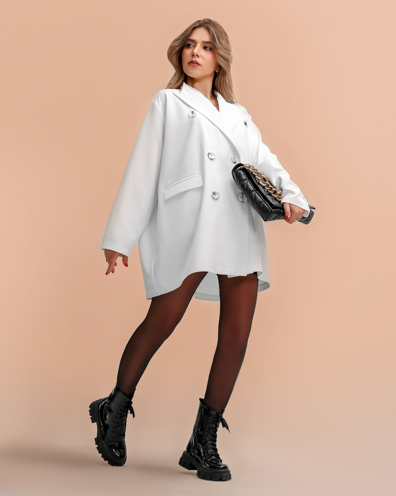
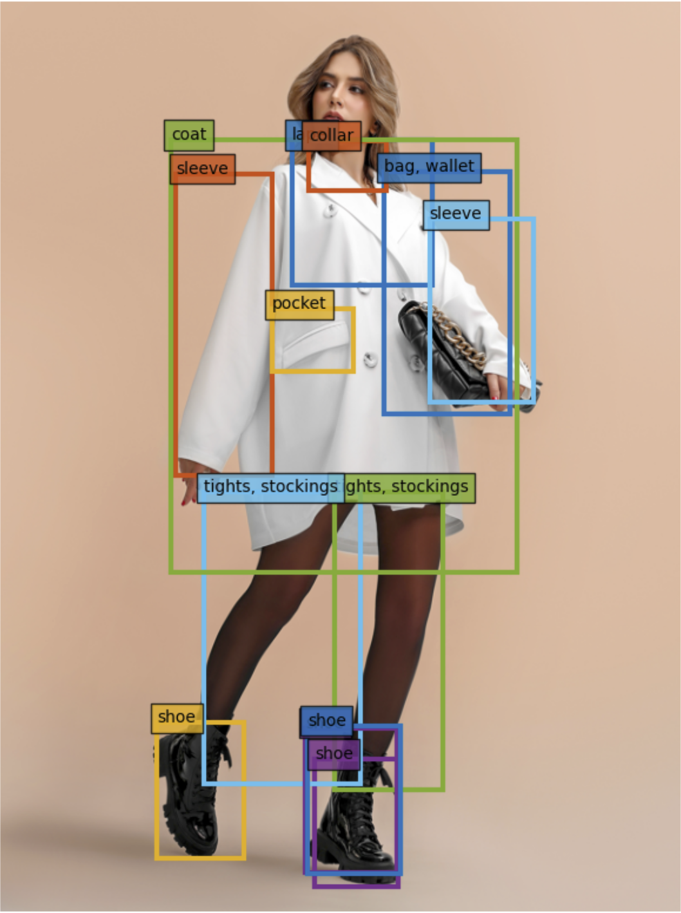

# Fine-tunning a YOLOs model for object detection

YOLOS is a model proposed in You Only Look at One Sequence: Rethinking Transformer in Vision through Object Detection. The model is designed for object detection and has achieved state-of-art performance on a COCOs dataset. It is currently available for download and use through Hugging Face, a platform whose Hub allows users to download datasets and trained models available for fine-tuning.

[Fashionpedia](https://huggingface.co/datasets/detection-datasets/fashionpedia) is one of more than 16000 datasets uploaded into HuggingFace Hub. It comprises 46781 images and 342182 bounding-boxes. The bounding boxes contain the following categories.

```python
[‘shirt, blouse’, ‘top, t-shirt, sweatshirt’, ‘sweater’, ‘cardigan’, ‘jacket’, ‘vest’, ‘pants’, ‘shorts’, ‘skirt’, ‘coat’, ‘dress’, ‘jumpsuit’, ‘cape’, ‘glasses’, ‘hat’, ‘headband, head covering, hair accessory’, ‘tie’, ‘glove’, ‘watch’, ‘belt’, ‘leg warmer’, ‘tights, stockings’, ‘sock’, ‘shoe’, ‘bag, wallet’, ‘scarf’, ‘umbrella’, ‘hood’, ‘collar’, ‘lapel’, ‘epaulette’, ‘sleeve’, ‘pocket’, ‘neckline’, ‘buckle’, ‘zipper’, ‘applique’, ‘bead’, ‘bow’, ‘flower’, ‘fringe’, ‘ribbon’, ‘rivet’, ‘ruffle’, ‘sequin’, ‘tassel’]
```

In this repository one may find two notebooks

- Fine tunning a YOLOs model in order to build a model that detects fashion objects
- Using a fine-tunning model in unseen images




